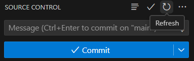
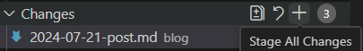
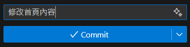
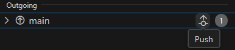

在這裡提供關於本網站編輯的教學，供管理員或其他願意協助編輯的成員參考。

<!-- truncate -->
:::success 本頁主要針對希望自行修改內容的用戶。如果僅需修改少部分內容，可直接聯繫管理員。
:::

## 基本要求

### 熟悉 Markdown 語法
* Markdown 是一種輕量級的標記語言，以其簡潔易讀的特性廣泛應用於文檔撰寫和網頁內容創建。
* Discord 也支援部分 Markdown 語法。學習 Markdown 十分簡單，幾分鐘即可掌握基本用法。
* 可通過 YouTube 或 B站等平台觀看相關教學視頻來學習。

### 擁有 GitHub 帳號
* 網站代碼儲存在 GitHub 上，編輯需要擁有一個 GitHub 帳號。

### (可選)學習 Git 使用
* Git 是一款版本控制系統，用於方便地管理和協作編輯文件。
* 可以自學 Git 基本操作，如 `pull`、`add`、`commit` 和 `push`。對於不熟悉 Git 的用戶，可以使用 Visual Studio Code 內建的 Git 管理工具，避免直接使用命令行。
* 也可以直接通過每頁底部的「編輯此頁」按鈕進行修改。

### (可選)申請加入協作者
* 聯繫管理員說明你希望協助編輯指南的意圖。
* 成為協作者可省略 Fork 和 Pull Request 等步驟，對不熟悉 GitHub 的用戶尤其有幫助。


## 方法一: 直接點擊「編輯此頁」
<details>
    <summary>優缺點</summary>
    * 優點
        * 修改單一檔案時較為方便。
        * 可在手機等設備上輕鬆操作。
    * 缺點
        * 無法快速預覽修改效果，需要等待網站構建完成（約兩分鐘）。
        * 每次修改多個文件時，每次 commit 都會觸發網站構建，可能會導致工作流程阻塞。
        * 新增頁面較為繁瑣。
</details>
* 此方法幾乎不需要學習 Git。
* 點擊後會直接跳轉到代碼頁面，可直接進行修改。
* 僅適合編輯單一頁面內容。若需修改多個頁面，請使用方法二。

## 方法二: 複製儲存庫至本地
:::warning 需自備git與node.js環境，自行爬文安裝
:::
* 這邊皆使用使用 VS Code 進行教學

### 本地建構
1. 首先，將儲存庫複製到本地：
    ```bash
    git clone https://github.com/TNTsky/SPKsmp-Docs.git
    ```
2. 右鍵點選 `以 Code 開啟` :\
    
3. 點擊 `` Ctrl+Shift+` `` 開啟終端機並輸入:
   ```bash
    npm install
    ```
4. 輸入以下命令運行專案
    ```bash
    npm run start -- --host 0.0.0.0
    ```
5. 即可在瀏覽器 `<本機IP>:3000` 進行預覽

### 編輯流程
1. 在每次編輯前確認同步情況\
   
2. 運行專案進行實時預覽
    ```bash
    npm run start -- --host 0.0.0.0
    ```
3. 參考下方文件結構編輯內容
4. 每次 `Ctrl+S` 保存時網頁皆會自動刷新
5. 完成修改確認後即可提交Commit
   <details>
        <summary>提交步驟</summary>
           1. 點擊 `+` 確認修改\
            
           2. 簡單填寫內容後點擊Commit\
            
           3. 點擊推送\
            
    </details>

## 頁面修改與添加

### 文檔
* 位於根目錄下的`/docs`資料夾
* 內部每個資料夾皆為一個類別，顯示在網頁左方選單
* 新增時可直接添加md檔或是資料夾
* 新增類別(資料夾)時內部需添加`_category_.json`檔案
* 格式可參考已添加之文件內容

### Blog
* 位於根目錄下的`/blog`資料夾
* 同樣，格式可參考已添加之文件內容
* `authors.yml`存放著作者資訊
* `tags.yml`存放標籤資訊

#### 其餘內容在不清楚是甚麼的情況下請別動

:::success 小提示
VScode在Markdown添加圖片時可直接貼上
:::