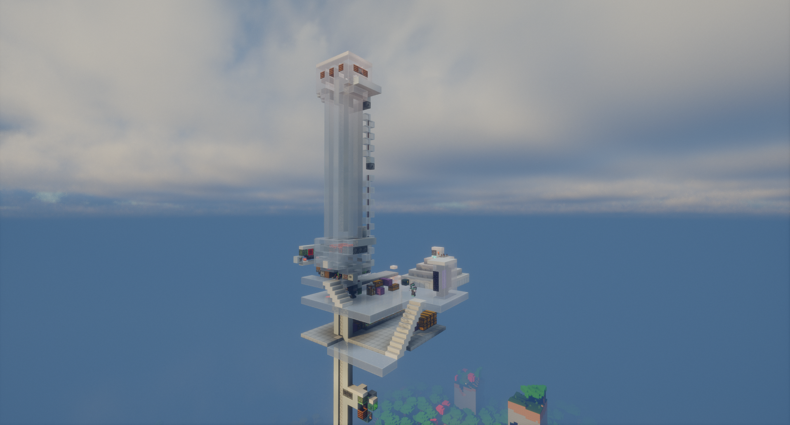

---

---

# 刷怪塔
各類刷怪塔

## 印鈔機
> 主世界 (-260, Y, -750)\
> 地獄 (-37, Y, -89)\


## 舊刷怪塔
> 主世界 (-189, Y, -1095)\
> 地獄 (-22, Y, -136)\
> 

## 沉屍塔
> 主世界 (1792, Y, 436)\
> 地獄 (224, Y, 55)\
> 

## 凋零塔
> 主世界 (7550, Y, -2600)\
> \
> 地獄 (941, Y, -326)\
> 
* 假人指令:
    ```
    /player Wither spawn at 939.51 185.00 -326.37 facing 1 1 in minecraft:the_nether
    ```

## 惡魂塔
> 地獄 (-180, Y, 250)\
> 請走旁邊的小地獄門\
> \
> 出來後沿著箭頭方向飛\
> \
> 主世界 (-1450, Y, 2040)\
> 


## 豬人塔
> 地獄 (200, Y, -350)\
> \
> 
+ 砍怪假人設定一直往前走(不知道為什麼有時候會被打到)
+ 空盒2000+不用補 
<details>
    <summary>舊版豬人塔</summary>
        > 地獄 (-400, Y, -100)\
        > \
        > 從 **最上方地獄門** 出來後，朝著箭頭向南方走即為處死裝置
        > \
        > 主世界 (-3360, Y, -720)\
        > 
</details>


## 刷經驗用豬人塔
> 地獄 (77, 247, -36)\
> 
:::warning 不刷豬人可能是因為偽和平沒關或是下面有人
:::

## 凋零玫瑰農場
> 終界 (-677, Y, 240)\
> \ 

## 鞋墊農場(豬肉塔)
> 地獄 (400, Y, -350)\
> \
> 
<details>
    <summary>舊版豬肉塔</summary>
        > 地獄 (-260, Y, -150) 位在舊豬人塔旁\
        > 
</details>

## 夜魅機
> 主世界 (786, Y, -489)\
> 
+ 站在裡面就可以開始掛機
+ 至少要掛一小時 

## 船吸刷怪塔
> 主世界 (-3528 , Y, -2840)\
> 
> 主世界 (-448, Y, -363)\
> 
