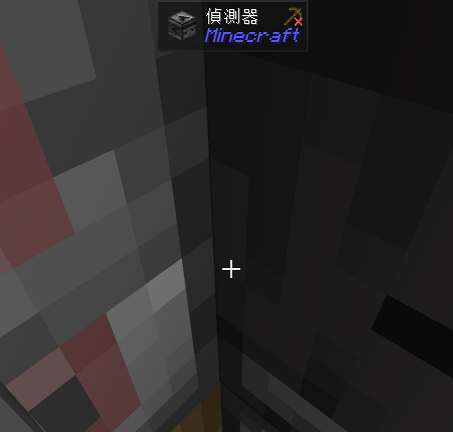
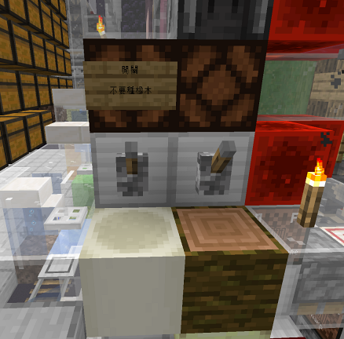

---

---

# 方塊農場
快速刷取各類方塊的地方

## 刷冰機
> 主世界 (1284, Y, -633)\
> 地獄 (160, Y, -78)\
> 

## 玄武岩機
> 地獄 (80, Y, -300)\
> 

## 樹廠
> 終界 (289, Y, 19)\
> 
* 效率很高，不需要掛整晚
* 故障麻煩在聊天室[@服主](https://discord.com/users/581468949829648384)，並附上圖片，將會評估要修或是回檔
* 叢林木會有樹苗回收率不足問題
<details>
    <summary>使用方式</summary>
        1. 站進此坑內\
            

        2. 對準偵測器的這格像素，並向前走到底\
            
        3. 放置假人
           ```
           /player tree spawn
           ```
        4. 右鍵假人打開背包，點選右上角連續使用\
            
        5. 在假人背包中，將要種的樹苗放到最下排第一格\
             
        6. 泥土上種上樹苗，到外面拉骨塊上的開關\
            
</details>
:::warning 注意
橡木請手動限高，在第八格高的位置放黑曜石\
其他樹種皆可以直接種(紅樹、黑橡木除外)
:::
