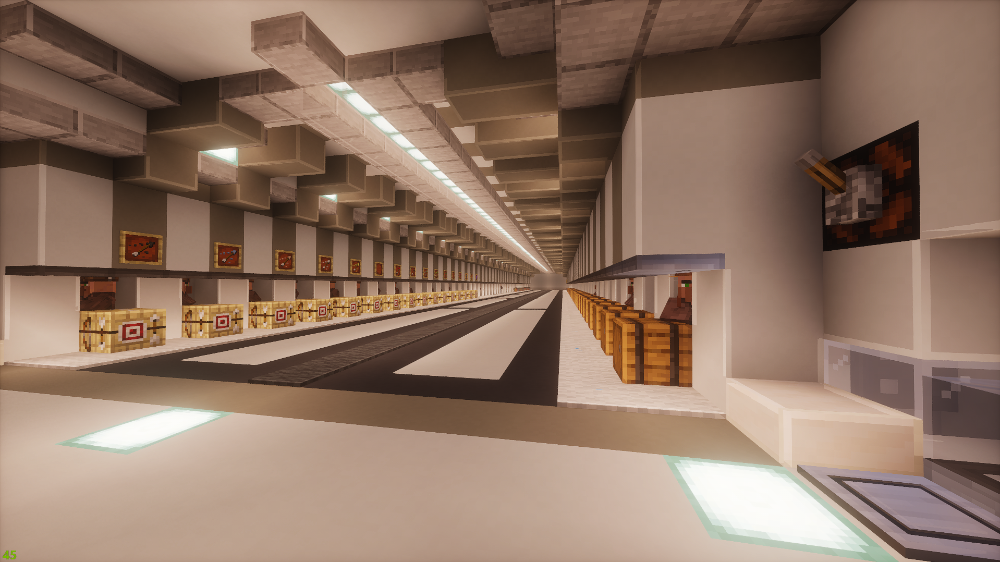

---

---

# 村民相關
各類村民相關設施

## 16核鐵人塔
> 主世界 (1200, Y, -346)\
> 地獄 (155, Y, -49)\

## 村民交易所
> 主世界(801, Y, 440)
> 地獄(99, Y, -55)

* 主世界進入有隱藏門 到了沒找到下去的路
* 共三層，分別為
* 第一層: 漁夫、製箭師、神職人員、石匠
* 第二層: 倉庫與地獄門
* 第三層: 圖書管理員 所有附魔書都有

    
打折機使用方式

      晚點再寫

