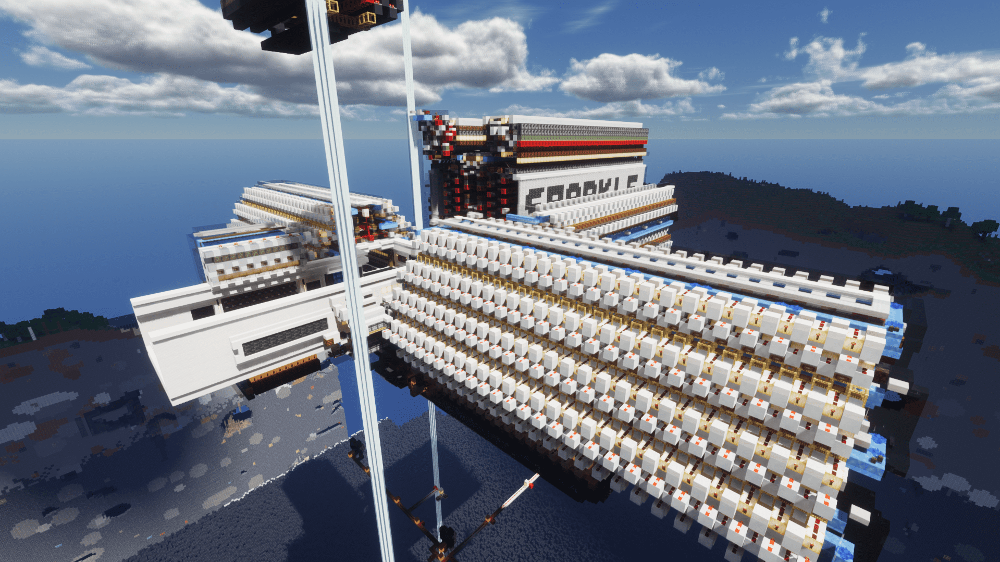
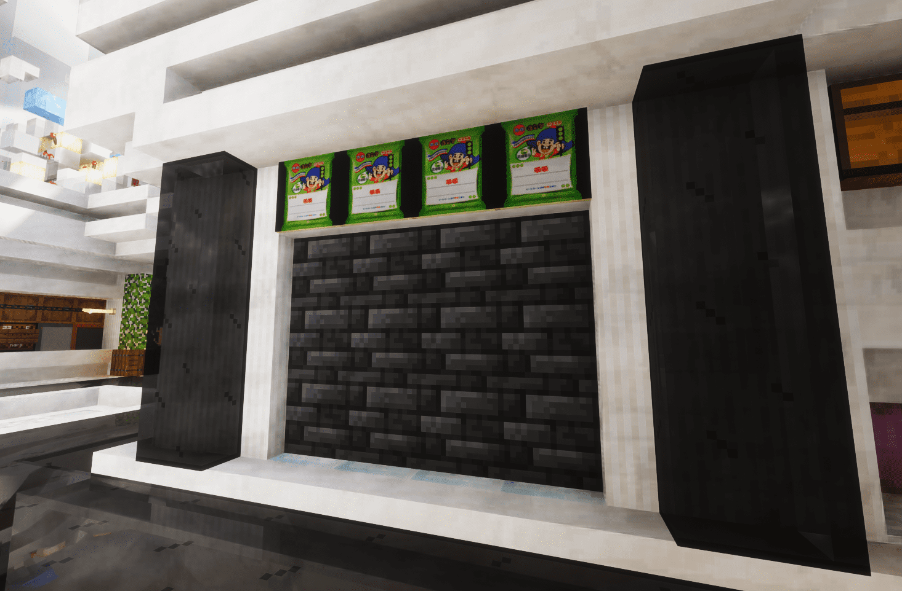
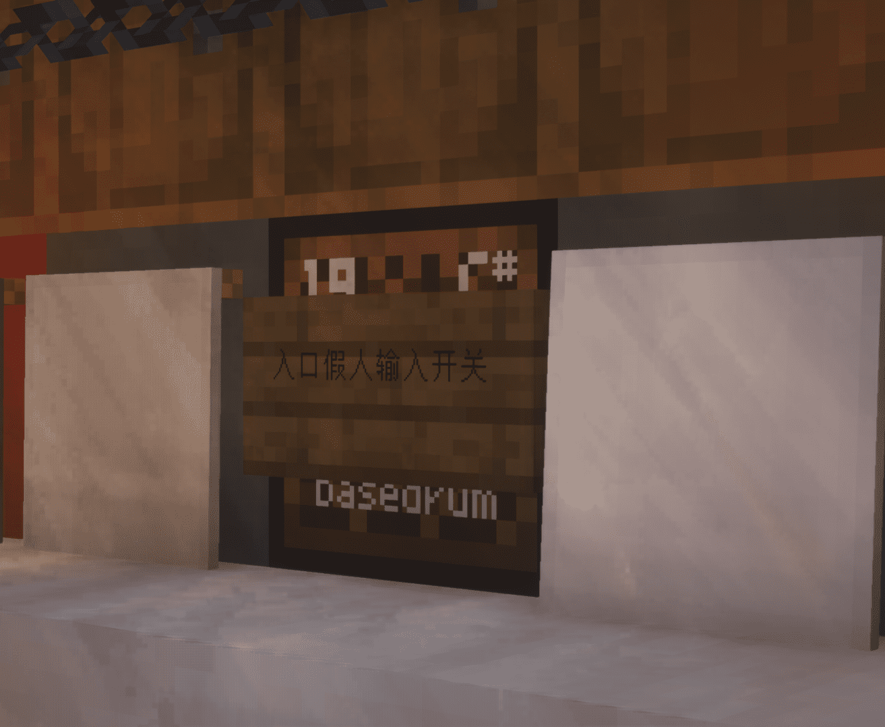
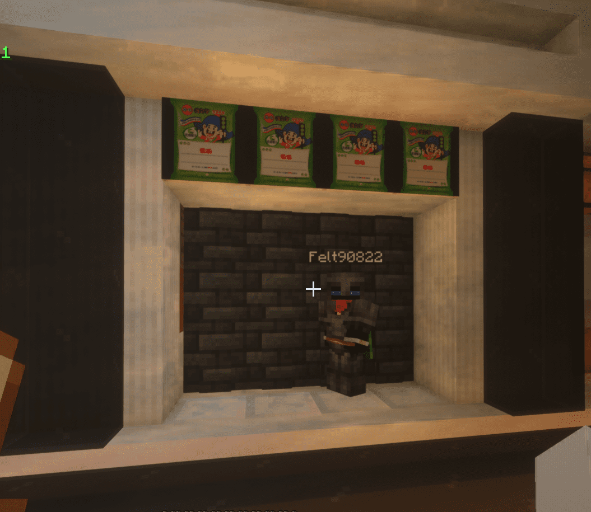

---

---

# 儲存設施
各類儲存設施

## 全物品
> 主世界 (700, Y, 0)\
> 地獄 (, Y, )\

    
使用方式

        * 法一: 直接投入物品
          * 在乖乖這裡對著石牆投入物品\
            
        * 法二: 使用假人
          1. 轉角處音符盒其中一個為假人投入鈕，按下後石牆將會縮回\
            
          2. 將假人召喚在此地，右鍵開啟其背包置入物品\
            
          3. 再按一次音符盒即可將假人推入
          * 玩家若不慎掉入，可按住`Shift`從通道離開

:::warning 滿的單一內容物界伏盒就別丟裡面了，直接放到對應的箱子
:::
