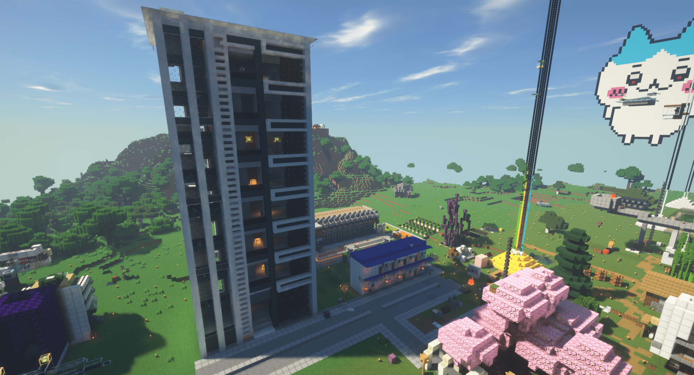
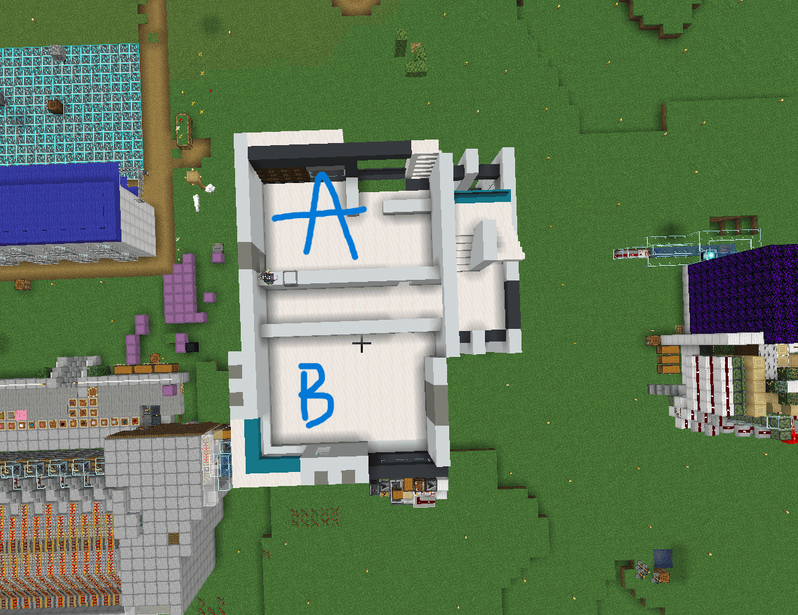
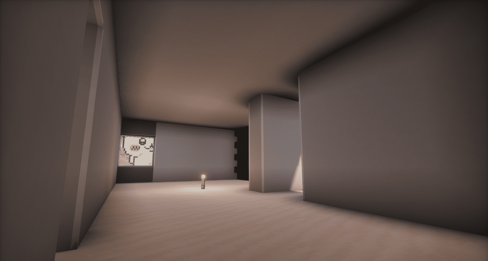
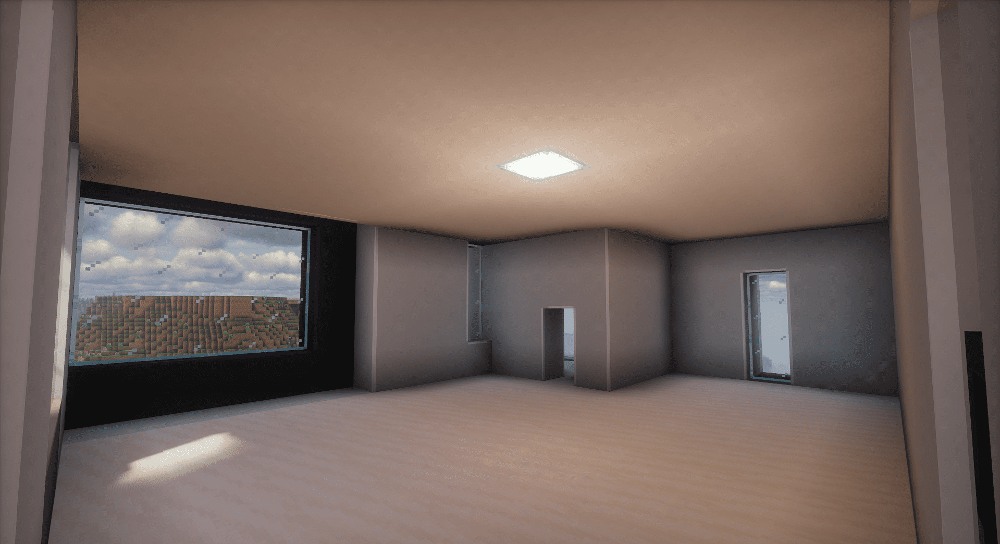

# 蛤
到底甚麼東西

## 新員工監獄 - 您在主城的理想居所

### 位置與環境

新員工監獄坐落於主城舊鐵皮屋旁(座標: 760 -320)，是為新加入我們大家庭的員工精心打造的監禁空間。其戰略性位置帶來諸多便利:

- 距離地獄門和全物品區僅數步之遙，工作生活兩不誤
- 遠離喧囂的交易所，提供寧靜舒適的生活環境
- 新鋪設的道路直達大樓門口，出行便捷
- 與舊全物品紀念公園為鄰，閒暇時可漫步其中，感受歷史氛圍
- 周邊綠化充足，空氣清新，是城市中難得的綠洲

*圖1: 新員工監獄大樓外觀 - 現代設計與自然環境的完美融合*

### 精緻牢型，滿足多樣需求

我們提供A、B兩種精心設計的牢型，以適應不同員工的監禁偏好。

*圖2: A型(上)和B型(下)牢房的平面布局*

#### A型牢房 - 緊湊實用的城市小窩

*圖3: A型牢房內部 - 舒適而富有設計感*

- 空間緊湊但功能齊全，適合單身或剛組建小家庭的員工
- 陽台朝向地獄門，欣賞繁忙城市的律動
- 特色景觀:櫻花山和吉伊卡哇盡收眼底，四季變換美不勝收
- 獨特的通風木牆設計，確保室內空氣流通，營造健康監禁環境

#### B型牢房 - 寬敞明亮的舒適之選

*圖4: B型牢房內部 - 寬敞明亮，適合小家庭*

- 更大的生活空間，滿足成長中家庭的需求
- 兩扇大面積落地窗，引入充沛自然光，提升監禁品質
- 陽台面向後山，遠離城市喧囂，享受寧靜時光
- 絕佳視野，每天都能欣賞到美麗的日出，開啟充實美好的一天

### 卓越的建築特色

1. 創新隔音設計：每層天花板採用雙層結構，有效阻隔樓上噪音，確保安靜的監禁體驗
2. 智能照明系統：光源巧妙嵌入天花板，營造柔和舒適的光線氛圍，可根據個人喜好調節
3. 高品質地板：採用進口石英材料，磁磚間幾乎無縫隙，美觀耐用且易於清潔
4. 全天候安保：24小時管理員值守，嚴格的訪客管理制度，為您的安全保駕護航
5. 多功能公共空間：一樓設有寬敞的公共區域，可用於小型聚會、業務洽談或是與鄰居茶敘
6. 靈活的空間規劃：兩位員工可合購同層樓面並將其打通，創造更大的生活空間
7. 個性化選擇：原則上一人一間，充分尊重個人隱私
8. 即時入住：門牌上沒有名字的牢房隨時可以入住，讓您迅速安頓下來

### 周邊配套設施

- 小型超市：大樓一層設有24小時便利店，日常用品隨手可得
- 健身房：配備現代化健身器材，幫助員工保持健康的生活方式
- 洗衣房：公共洗衣設施，解決大件衣物清洗難題
- 郵件室：設有智能快遞櫃，收發包裹更加便捷
- 自行車停放處：鼓勵綠色出行，為騎行愛好者提供安全的車輛存放空間

### 社區活動

我們定期組織各類社區活動，幫助新員工快速融入大家庭：

- 每月一次的新員工歡迎會
- 節日聯歡晚會
- 週末郊遊活動
- 興趣小組（讀書會、烹飪班、瑜伽課等）

### 租住政策

- 簽訂為期一年的租約，可續簽
- 租金直接從薪資中扣除，無需額外操心
- 提供基本傢俱，員工可根據個人喜好添置其他物品
- 允許飼養小型寵物，但需遵守相關規定

### 預約參觀

如果您對我們的新員工監獄感興趣，歡迎預約參觀。您可以聯繫人力資源部門安排合適的時間，我們的工作人員將為您提供詳細介紹和解答任何疑問。

入住新員工監獄不僅是選擇一個居所，更是加入一個充滿活力的社區。在這裡，您可以在舒適的環境中專注工作，結識志同道合的朋友，享受平衡而充實的生活。我們期待您的加入，共同締造美好的家園！

:::tip 以上所有內容純屬唬爛
:::