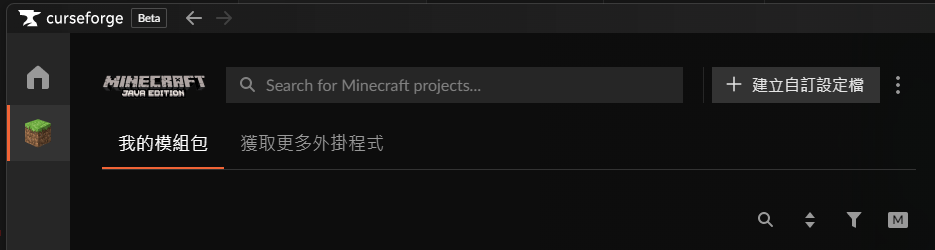
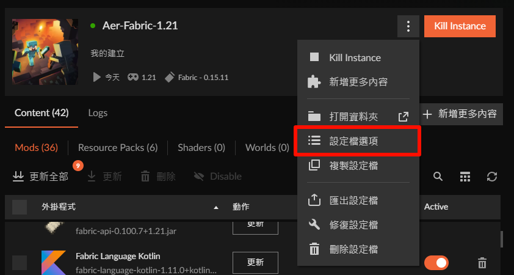
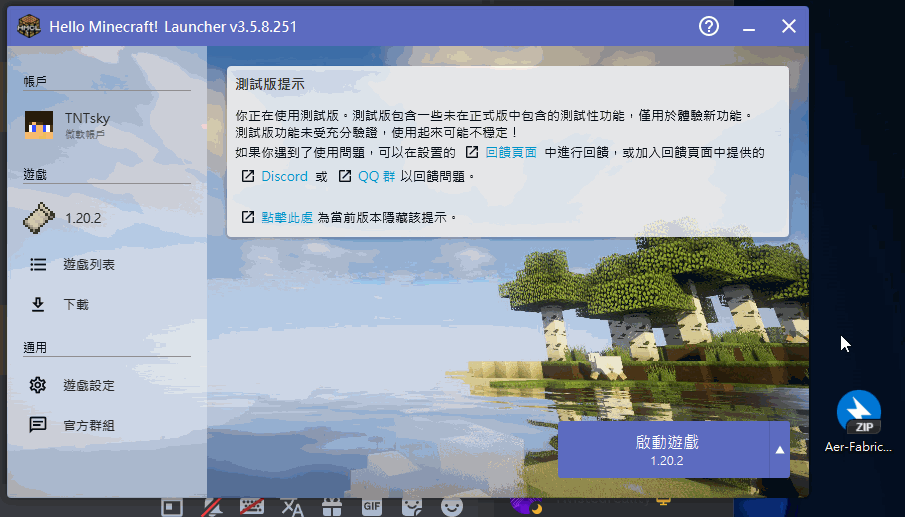
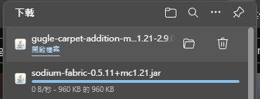
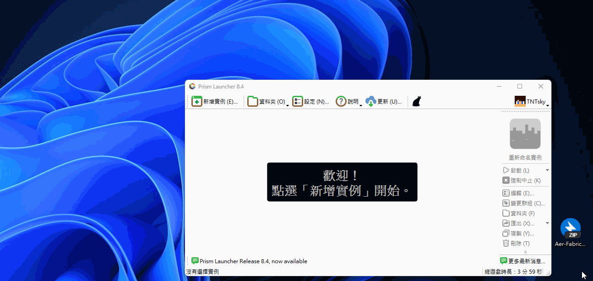

# 安裝模組整合包

本篇主要簡單介紹模組整合包與如何安裝，在此不提及整合包的製作

## 簡單介紹
整合包內通常含有以下內容:
* `/mods/` : 各項模組
* `/config/` : 模組設定
* `/resourcepacks/` : 資源包(材質、音效等)
* `/shaderpacks/` : 光影
* `options.txt`：遊戲設定(畫面、按鍵等)

    
整合包分類

        依照打包形式的不同，通常可分成以下幾種:
        ### (推薦)CurseForge包
        * 檔案通常最小
        * 安裝時才從平台上下載所需模組
        * 通用性最高
        * 格式為`zip`
        ### Modrinth包
        * 與CurseForge包相同，安裝時才下載模組
        * 檔案同樣也很小
        * 格式通常為`mrpack`，也會有`zip`
        ### 個別啟動器匯出
        * 包含完整模組內容，檔案較大
        * 通用性較低
        * 內部有時會附有啟動器便於遊玩
        ### 手動精簡包
        * 內部只包含`mod`、`config`等資料夾
        * 須自行拉入遊戲資料夾
        ### 無腦全包
        * 將整個遊戲資料夾連帶核心全部壓縮在一起
        * 檔案大小突破天際
        * 正面對決版權相關問題

## 如何安裝
以下列出幾款啟動器的安裝整合包方式，啟動器載點皆可在[第三方啟動器推薦](/docs/other/launcher)取得。

本服主要提供CurseForge包，可用於除 **Modrinth** 外大部分啟動器。

:::warning 整合包請別自行拆開
由於大多數模組皆會在安裝時自動下載，拆出的資料夾內僅有少量檔案，將導致內容不全，若要自行添加請使用手動精簡包
:::

:::danger 安裝後盡量避免更新
整合包通常已測試過穩定性，更新可能會產生模組間的相容性問題。\
(經測試，本服提供的整合包在模組全部更新後，資源包`Stay_True_1.21`與`Default Connected Textures`將會導致遊戲崩潰，可嘗試停用)
:::

### [CurseForge App](/docs/other/launcher#curseforge-app)
* 僅支援安裝CurseForge包
* 不同版本介面略有差異，請尋找`匯入(Import)`字樣

    
停用更新功能

        * 更新可能導致模組衝突，為避免誤觸更新，可將內容鎖定\
            \
        * 將`允許此設定檔的内容管理`取消勾選即可\
            

### [PCL2](/docs/other/launcher#pcl2)、[HMCL](/docs/other/launcher#hmcl)
* 支援 CurseForge、Modrinth、MCC、MCBBS 等幾乎所有格式整合包
* 直接將整合包**拖入啟動器視窗**便可開始安裝
* 安裝完點擊`版本选择`選中整合包後即可啟動遊戲\
  

### [Prism Launcher](/docs/other/launcher#prism-launcher)
* 支援 CurseForge、Modrinth、MCC 等常見整合包
* 直接將整合包**拖入啟動器視窗**便可開始安裝

    
彈出: 找到被封鎖的模組

        * 請勿直接點擊OK (點惹就關掉重來一遍)\
            
        * 請依提示點擊`開啟下載網頁`下載缺少檔案\
            
        * 顯示找到所有模組後即可按下OK繼續\
            

    

### [Modrinth App](/docs/other/launcher#modrinth-app)
* 僅支援安裝Modrinth包
* 無法直接匯入CurseForge包
* 但可從 CurseForgeApp、PrismLauncher 等其他啟動器匯入設定檔
* 自行研究 :D