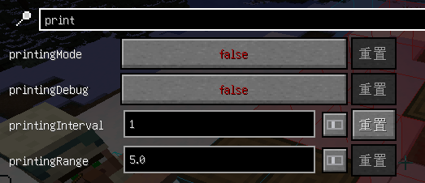

# 投影打印機
* Litematica Printer為投影模組的拓展，允許玩家在投影中自動放置方塊來更快地建造大型結構
* 設定頁面與投影模組共用

:::warning 注意
在某些伺服器中用此模組可能被判定為作弊，使用前最好詢問管理員
:::

:::danger 警告
複雜紅石機械請勿使用此功能，高機率放錯導致機器無法正常運行
:::

## 常用按鍵
* 預設按鍵
  * **開啟自動放置:** ~~`CapsLock`~~(為了防止誤觸已改為`Ctrl+CapsLock`)
  * <s>**長按放置:** `V`</s> (與靈魂出竅衝突，已停用)

## 設定調整
   

* 打印間隔(printingInterval):
  * 數字越小，打印越快
  * 如果放出了幽靈方塊，請嘗試增加數值
* 打印範圍(printingRange):
  * 可理解為手的長度
  * 伺服器中建議設定較低值

## 使用方法
* 關於投影模組用法請查看[Litematica(投影)教學](/docs/mod/use/litematica/litematica)
* 放置原理圖後點擊`Ctrl+CapsLock`即可開啟自動放置模式\
  
* 自動功能不含破壞方塊與懸空放置

:::warning 使用完後記得關閉!!!
