# Item Scroller 物品滾輪
* 本模組增加幾個使用滑鼠在物品欄裡移動物品的方法。透過一些按鍵和滑鼠操作的組合，實現更多功能。

## 常用快速鍵
* 開啟設置介面: `I+C`
* 容器整理(滑鼠所指): `R`
* 開啟配方視圖: `A`

## 容器內快速移動鍵
* 這邊`滾輪`指的是`滾動滑鼠滾輪`，並非點擊中鍵
* 以下大部分`滾輪`操作可與`左鍵`通用

### 移動全部
* `Alt+Shift+滾輪`\
  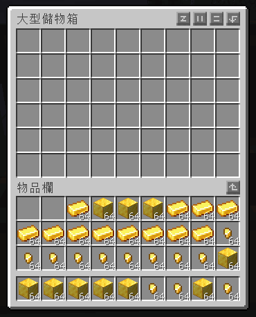

### 移動相同
* `Alt+滾輪`\
  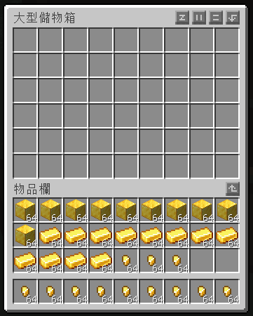

### 移動一組
* `Shift+滾輪`\
  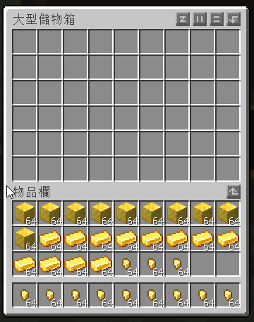

### 保留一個
* `Shift+右鍵`\
  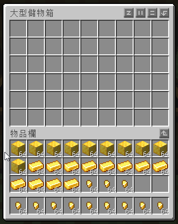

### 丟棄同類
* 按住`Shift`並`點擊窗口外`\
  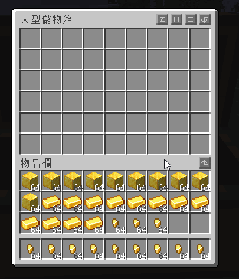

## 快速合成
> 雖然`一键背包整理Next`有添加快速補充的選框，但在大量合成時`物品滾輪`提供的快速合成功能更加迅速

### 加入合成列表
1. 按下`A`可開啟合成視圖\
   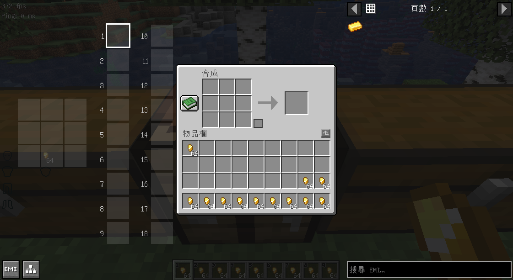
2. 點擊或使用滾輪切換你想保存的欄位
3. 對著`成品`點擊`中鍵`即可加入列表\
   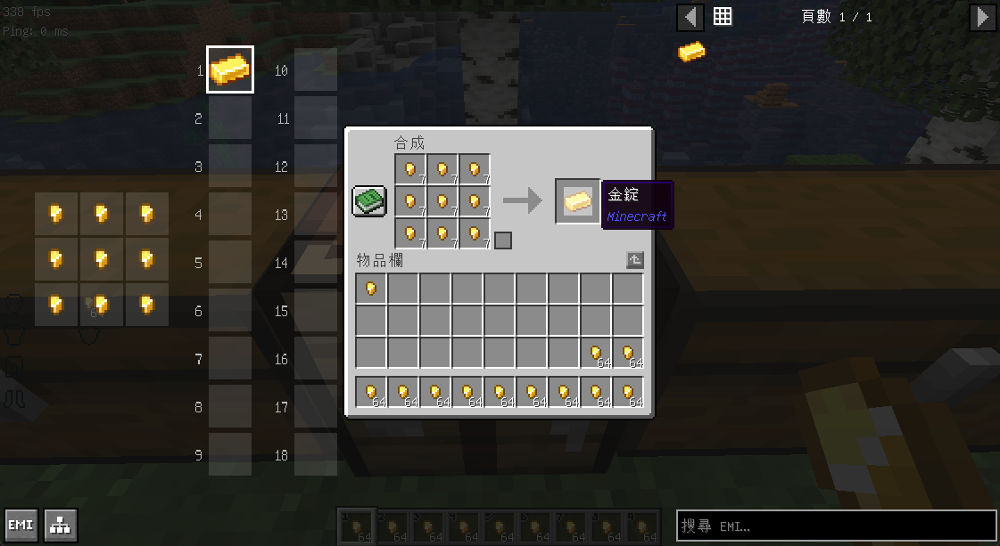
4. 切換欄位後可加入更多\
   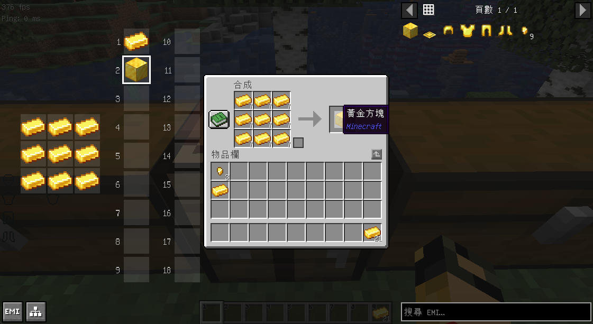
5. 對著空成品操作即可移除\
   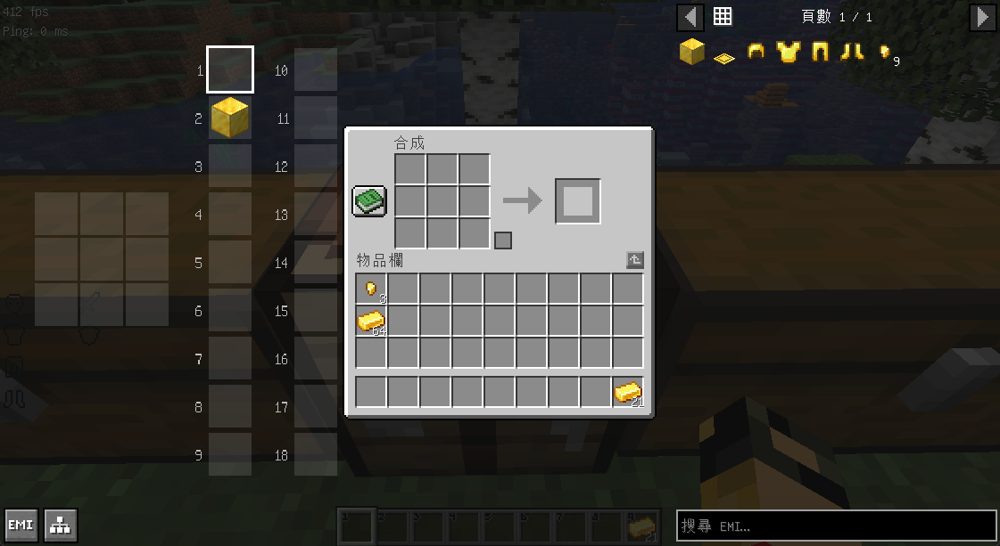
   
### 一鍵合成

:::warning 注意
一鍵合成是合成你在列表中選取的物品，並非當前合成台內的成品
:::

1. 按住`A`並切換欲合成物品\
   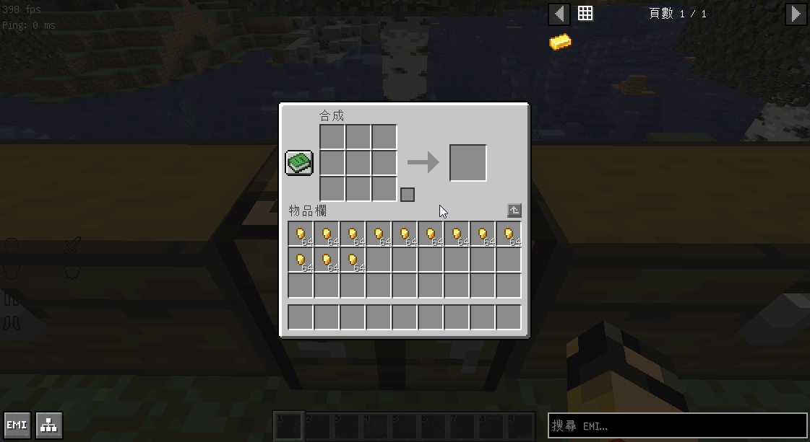
2. 點擊`Ctrl+C`快速合成\
   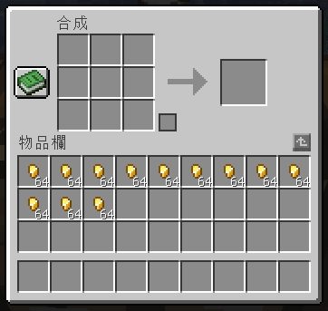
3. 若要將產物丟出請點擊`Alt+Ctrl+C`\
   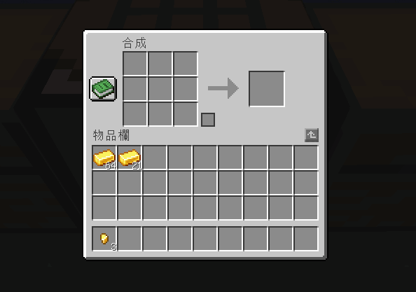