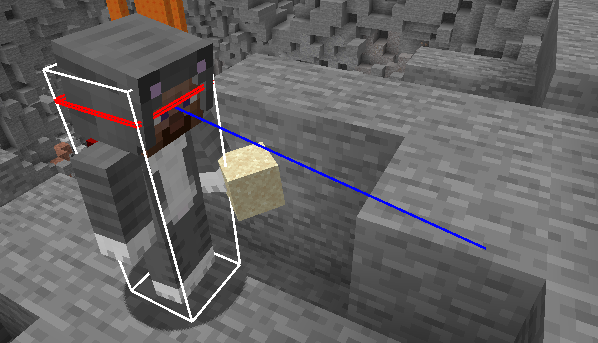
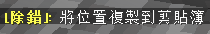
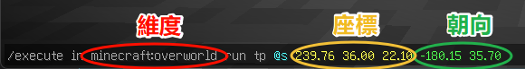
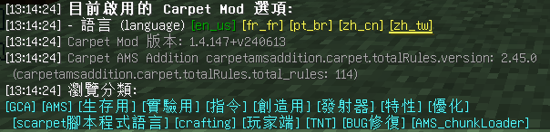
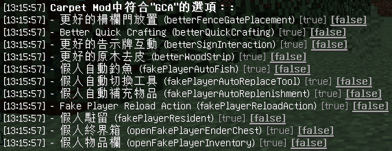
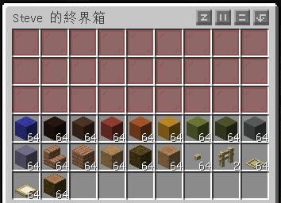

# Carpet 假人使用教學

假人是Carpet地毯模組包含的其中一項功能，用於生成一位可操控的虛擬玩家，可協助進行長時間作業

## 調整預設語言
* 繁體中文:
  ```bash
    /carpet setDefault language zh_tw
  ```
* 簡體中文:
  ```bash
    /carpet setDefault language zh_cn
  ```

## 指令用法

### 召喚假人
* 召喚一隻假人，位置方向、遊戲模式皆與玩家相同
  ```bash
    /player <name> spawn
  ```
* 點擊`F3+B`顯示碰撞箱，可查看假人視線\
  

### 指定假人召喚位置
    ```bash
    /player <name> spawn at <座標> facing <朝向> in <緯度>
    ```

<details>
    <summary>獲取座標與朝向</summary>
    
    1. 點擊`F3+C`複製當前位置訊息\
        
    2. 觀察複製出的指令:
        * 最前方為緯度
        * 數字前三項為座標
        * 最後兩項為朝向
    3. 資訊如下:\
        
    4. 修改後召喚指令即為:\
        
        
</details>

### 移除假人
> 本指令是使假人下線，並不是殺死他
```bash
/player <name> kill
```
:::success 殺死假人將會使其噴裝並下線
:::

### 執行動作
    ```bash
    /player <name> <行為> (可選參數)
    ```

<details>
    <summary>常用行為列表</summary>

    | 行為      | (可選參數)                       | 說明         |
    | --------- | -------------------------------- | ------------ |
    | attack    | continuous(持續)、interval(定時) | 點擊左鍵     |
    | use       | continuous(持續)、interval(定時) | 點擊右鍵     |
    | mount     |                                  | 自動騎乘     |
    | dismount  |                                  | 取消騎乘     |
    | drop      |                                  | 丟出一個物品 |
    | dropStack |                                  | 丟出一組物品 |
    | jump      |                                  | 跳           |
    | look      | \<方位\>                           | 轉向         |
    | sneak     |                                  | 蹲下         |
    | unsneak   |                                  | 站起         |
    | stop      |                                  | 停下所有動作 |
</details>


## GCA擴充功能
> 伺服器端需安裝 [GugleCarpetAddition (GCA模組)](https://www.mcmod.cn/class/7305.html)
<details>
    <summary>啟用GCA擴充功能</summary>
      * 輸入以下指令可檢視設置
        ```bash
        /carpet
        ```
        
      * 點擊 `[GCA]` 開啟假人設置\
        
      * 依需求點擊右側以開關功能

</details>
:::warning 注意
請勿在以下容器界面中使用快速鍵 (尤其是**整理功能**)，將會導致預期外操作，甚至崩潰
:::

### 開啟假人背包/操作面板
> 需啟用`openFakePlayerInventory`
* 對著假人點擊右鍵可開啟其背包\
  

### 開啟假人終界箱
> 需啟用`openFakePlayerEnderChest`
:::danger 經測試，在假人終界箱內使用`物品滾輪`的`容器整理`功能，遊戲將會崩潰
:::
* 對著假人按著`Shift`並點擊右鍵可開啟其終界箱\


### 自動釣魚
> 需啟用`fakePlayerAutoFish`
* 給假人釣竿後，並讓其點擊右鍵(非連續)即可
  ```bash
  /player <name> use
  ```
* 欲停下同樣讓其右鍵一次即可
  