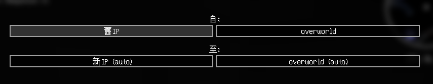
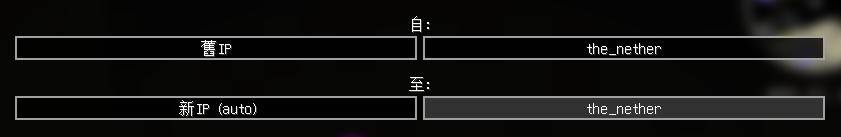

# Xaero's 地圖轉移

* 因本模組每個世界的地圖是分開的
* 因此更換伺服器域名(IP)後會造成地圖遺失
* 本篇提及如何將地圖轉移

## 世界地圖轉移
* 世界地圖沒有提供遊戲內的轉移功能，須自行至遊戲目錄更改
1. 開啟[遊戲目錄](/docs/other/game-path)
2. 進入`XaeroWorldMap`資料夾內\
    
3. 將舊IP更名為新IP (新的可直接刪掉)\
   
4. 即轉移完成\
   

## 定位點轉移
* 定位點若按照上述方法轉移可能導致維度異常
* 可直接使用遊戲內提供的轉移功能
1. 按`U`開啟定位點，點擊`選項`-`轉移`\
   
2. 依照IP提示，將相同維度名稱依序轉移
   * 主世界\
       
   * 地獄\
       
   * 終界\
       

:::warning 若新IP沒出現其他維度，請到目標維度進行轉移作業
:::
