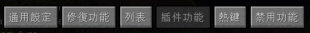
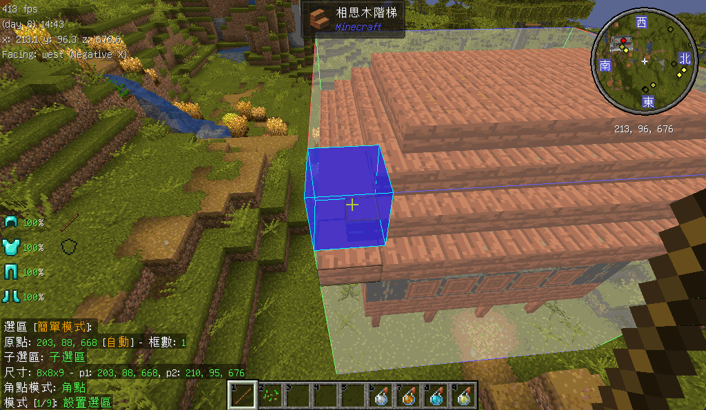
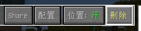
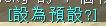

# Litematica(投影)教學

* 本模組讓玩家能夠將建築保存為一個結構文件，此文件稱為schematics(原理圖/示意圖)，以投影的方式讓玩家更方便地建造
* 本文簡單介紹投影模組的基本用法
* 漢化包來源:[Starry-City/StarryCity-zh_tw](https://github.com/Starry-City/StarryCity-zh_tw)

## 常用按鍵
* 預設按鍵
  * **開啟選單:** `M`
  * **開啟設定:** `M+C`
  * **選區編輯器:** `數字鍵盤*`
  * **管理已放置的投影:** `M+P`
* 整合包修改按鍵
  * **切換輕鬆放置模式:** `X`
  
其他熱鍵可按需添加

## 保存投影
1. 拿著木棒，使用 `Ctrl+滾輪` 切換至模式1\
    
2. 點擊`左鍵`設置第一個角點(可搭配靈魂出竅使用)\
    
3. 可透過 `Alt+滾輪` 進行微調\
   
4. 點擊`右鍵`設置第二個角點
5. 開啟`選區編輯器`，點擊`保存原理圖`\
   

## 放置投影
1. 拿著木棒，使用 `Ctrl+滾輪` 切換至模式2\
   
2. 開啟選單，點選`加載原理圖`\
   
3. 使用木棒點擊與`Alt+滾輪`調整位置\
   
4. 點擊`M+P`可管理已放置的原理圖 (旋轉/開關/刪除)\
   
5. 在`配置`-`渲染層`中，設置`此層之下`並點擊`定位到玩家`\
   
6. 此渲染層模式下，`PgUP`/`PgDn`可增減層數
   
7. 點擊`X`開啟輕鬆放置模式
   > 此模式下可自動切換手中物品，並可懸空放置方塊\
   > 
8. 對著投影放置方塊即可(背包需有物品)
9. 完成後點擊`M+P`將投影刪除

:::success 更輕鬆地建造
搭配模組 [Litematica Printer(投影打印機)](/docs/mod/use/printer)，可自動放置方塊
:::

## 結構文件(原理圖)提取/匯入
* 預設儲存位置在遊戲目錄下的`schematics`資料夾
* 可從資源包資料夾返回上層後找到\
  
* 若無此資料夾，請自行新增
* 匯入直接將檔案加進來即可(無須重啟遊戲)