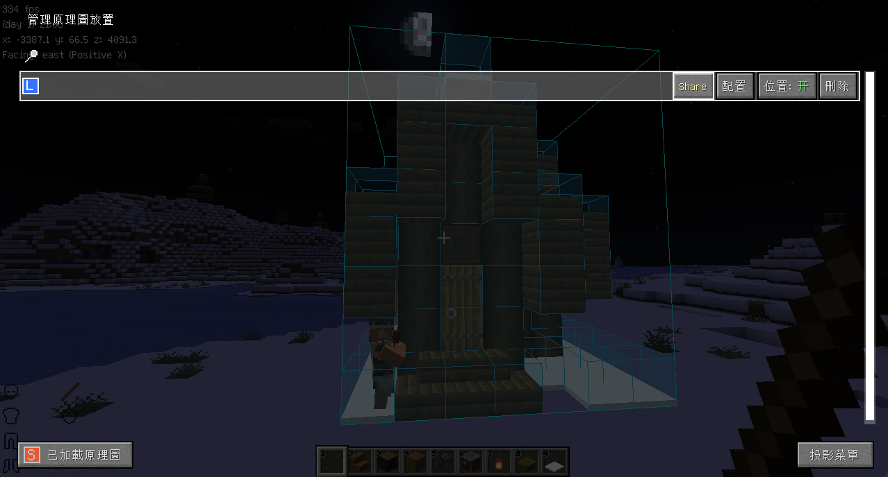

# Syncmatica 共享原理圖
* 本模組使你在伺服器中與其他玩家共享投影原理圖及其位置
* 伺服器需安裝此模組才可使用

## 使用方法
* 關於投影模組用法請查看[Litematica(投影)教學](/docs/mod/use/litematica/litematica)
* 放置原理圖後點擊`M+P`開啟管理，按住`Shift`同時點下`Share`\
  
* 其他玩家開啟投影選單，點擊`View Syncmatics`即可看到\
  