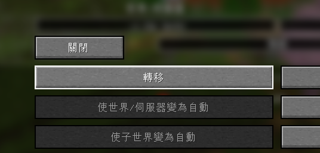

# Xaero's 地圖轉移

* 因本模組每個世界的地圖是分開的
* 因此更換伺服器域名(IP)後會造成地圖遺失
* 本篇提及如何將地圖轉移

## 世界地圖轉移
* 世界地圖沒有提供遊戲內的轉移功能，需自行至遊戲目錄更改
1. 開啟[遊戲目錄](/docs/other/location)
2. 進入`XaeroWorldMap`資料夾內\
    
3. 將舊IP更名為新IP (新的可直接刪掉)\
   
4. 即轉移完成\
   

## 定位點轉移
* 定位點若按照上述方法轉移可能導致緯度異常
* 可直接使用遊戲內提供的轉移功能
1. 按`U`開啟定位點，點擊`選項`-`轉移`\
   
2. 依照IP提示，將相同緯度名稱轉移(只可轉移當前緯度)
   
3. 到 地獄/終界 將 nether/end 同樣轉移即可

