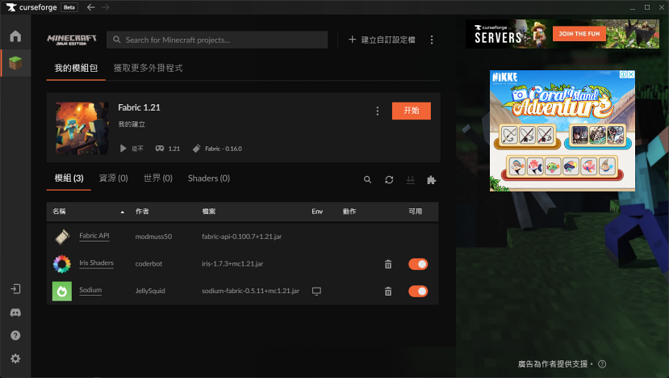
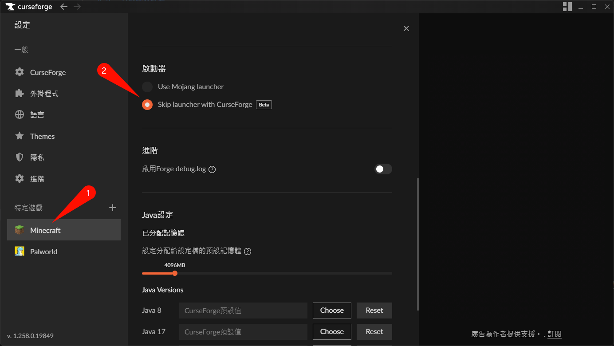
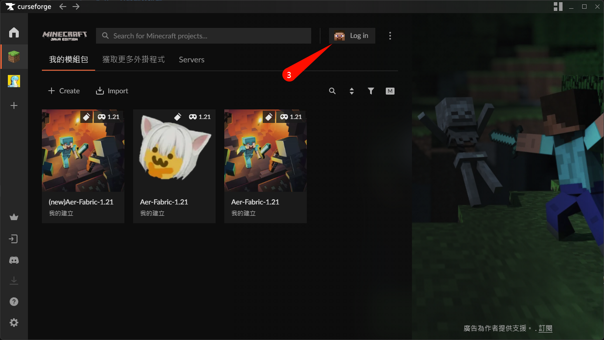
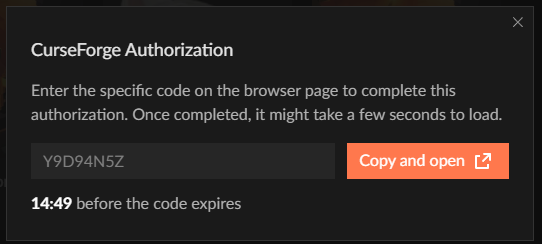
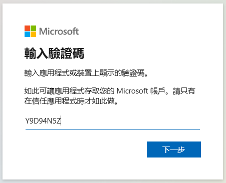
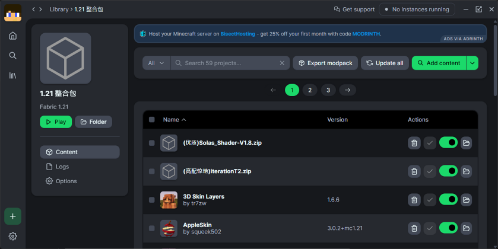
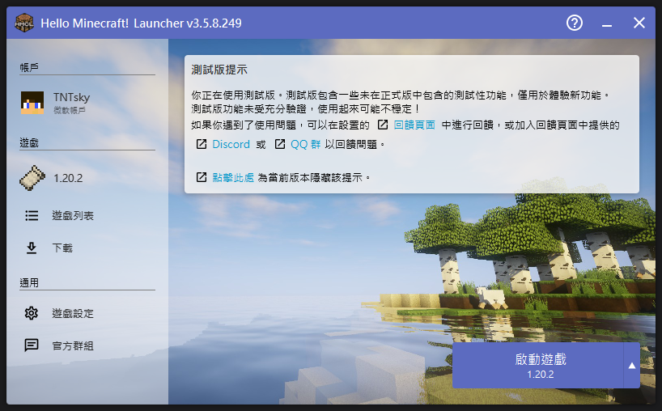
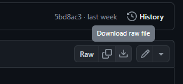

# 第三方啟動器推薦

由於Minecraft官方啟動器功能過少<s>(筆者直接不想載)</s>，在安裝模組等操作較為麻煩，因此在這邊推薦幾個較知名的第三方MC啟動器

* 較推薦使用:
  * [**CurseForge App**](#curseforge-app): 功能完善但占用較高且有廣告
  * [**PCL2**](#pcl2): 輕量易上手但須稍作設定
  * [**HMCL**](#hmcl): 功能齊全但界面較PCL複雜
* 相對不推薦但可嘗試:
  * [**Prism Launcher**](#prism-launcher): 介面相對較亂，上手需花較多時間
  * [**Modrinth App**](#modrinth-app): 若不怕全英文的話還不錯，但模組數量可能略少於CurseForge
* 不推薦使用:
  * **TLauncher**: 某些因素被視作為惡意軟體，非必要請勿使用([詳情](https://youtu.be/SBTH9n6lz9o?si=gi97Utr1IkyPa_f7))

也可以看看界面哪個順眼就使用哪個，以下推薦的啟動器基本上功能皆夠一般玩家使用

## CurseForge App
> 載點: https://www.curseforge.com/download/app

* 推薦未接觸過模組的玩家使用
* 大部分的模組都在這平台，模組下載會自動安裝前置挺方便
* 程式介面周遭會出現廣告
* 本體功能較雜資源消耗較高

    
可略過原版啟動器

    * 不做修改時，預設使用原版啟動器開啟遊戲
    * 可改為由CurseForge直接啟動，方便查看除錯日誌(Logs)
    1. 在設定中進行修改\
      
    2. 修改後啟動遊戲需先登入\
      
    3. 依指示點擊按鈕前往登入\
      
    4. 將自動複製的文本貼上\
      
    5. 完成後回到啟動器稍等片刻即可

## Modrinth App
> 載點: https://modrinth.com/app

* 占用資源少，適合各種配置的電腦使用
* 新程式可能含有些BUG，暫不推薦使用
* 目前尚未支援中文

## Prism Launcher
> 載點: https://prismlauncher.org/download/

* 界面相對複雜，需要一些時間來適應
* 支援離線登陸(盜版)
* <s>UI偏醜</s>

## HMCL
> 載點(下載`.exe`檔): https://github.com/HMCL-dev/HMCL/releases/latest 

* 占用資源少，啟動速度快，適合低配置電腦。
* 界面較為簡單
* 模組名自動添加中文方便辨識
* 支援離線登陸(盜版)

    
建議設置

    將遊戲設定中，將`執行路径`更改為:`各版本獨立`\
    \
    在後續添加不同版本mod時不會混在一起

## PCL2
> 載點: https://github.com/Hex-Dragon/PCL2/blob/main/最新正式版.zip \
> 下載按鈕位於右方此處\
> 

* 與HMCL相似，功能較HMCL少，但介面更加簡潔
* 直覺易上手
* 模組名自動添加中文方便辨識
* 支援離線登陸(盜版)

    
建議設置

    將設置中`版本隔離`更改為:`隔离可安装Mod的版本`\
    \
    在後續添加不同版本mod時較好管理

