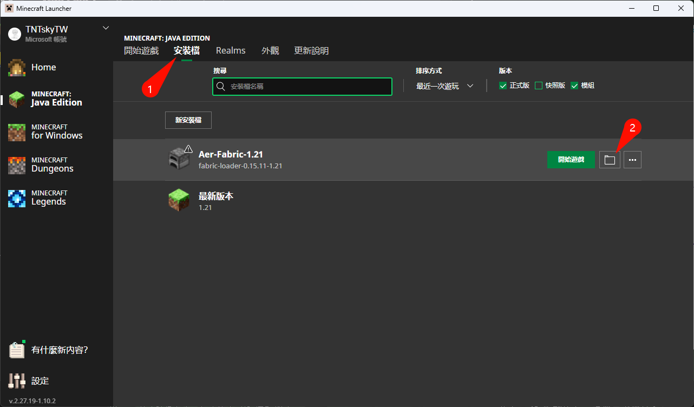
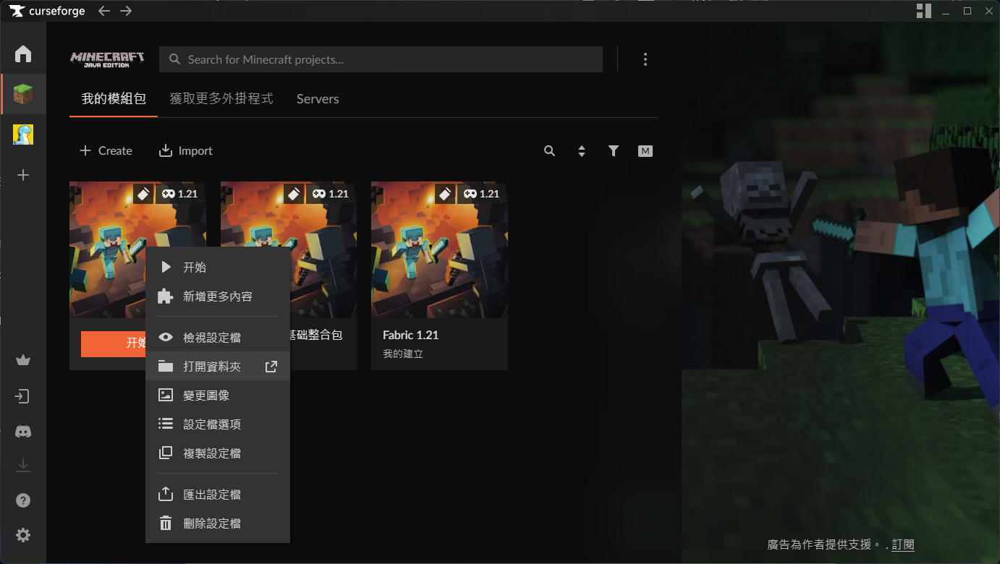
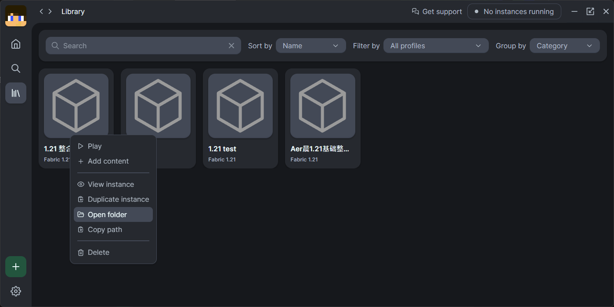
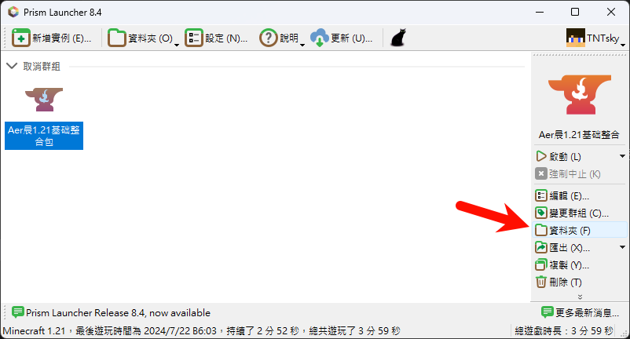
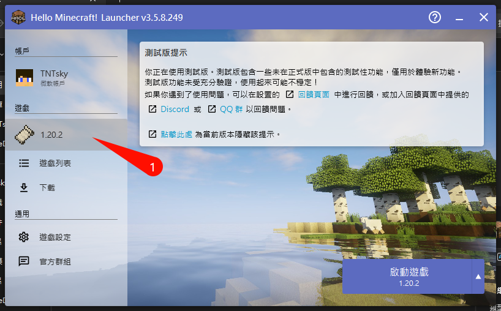
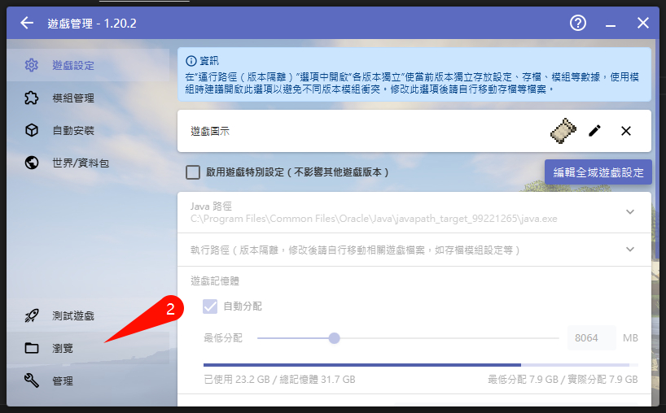
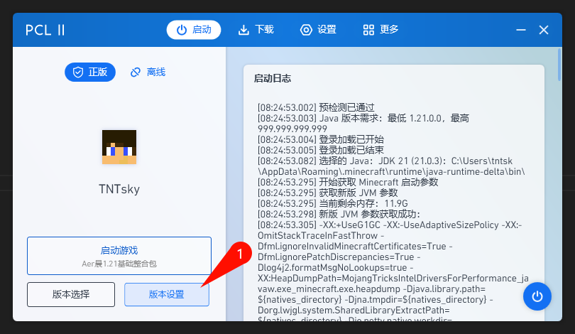
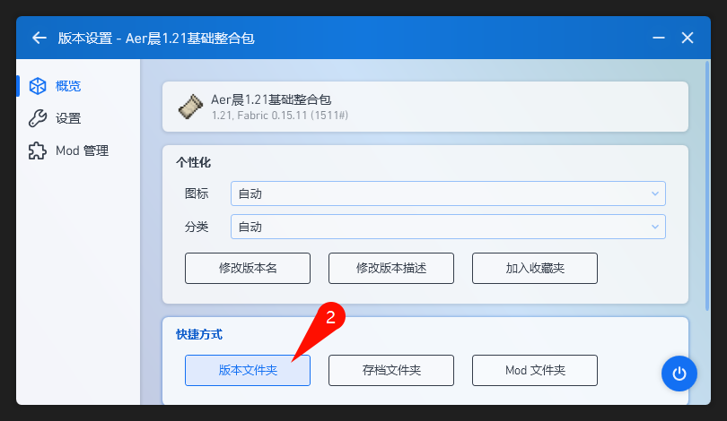

# MC遊戲目錄

在安裝地圖、模組等各種內容時，時常需要將檔案放置到遊戲目錄中，本文簡單說明各個啟動器如何開啟遊戲目錄

## 原版(官方啟動器)
### 安装檔->資料夾圖示

## CurseForge App
### 右鍵->開啟資料夾

## Modrinth App
### 右鍵->Open folder

## Prism Launcher
### 右側資料夾

## HMCL
### 點擊版本->瀏覽

## PCL2
### 版本設置->版本資料夾

