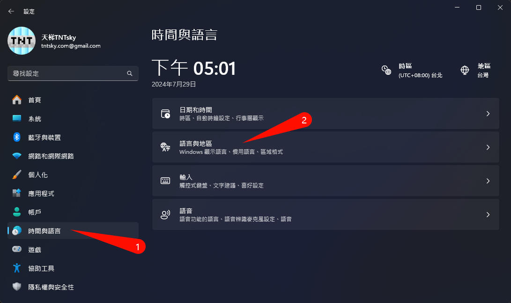
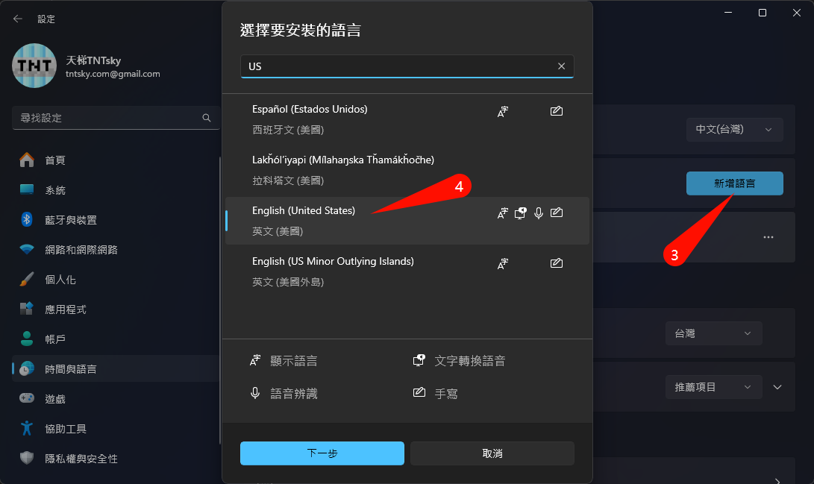
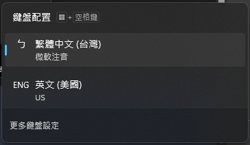
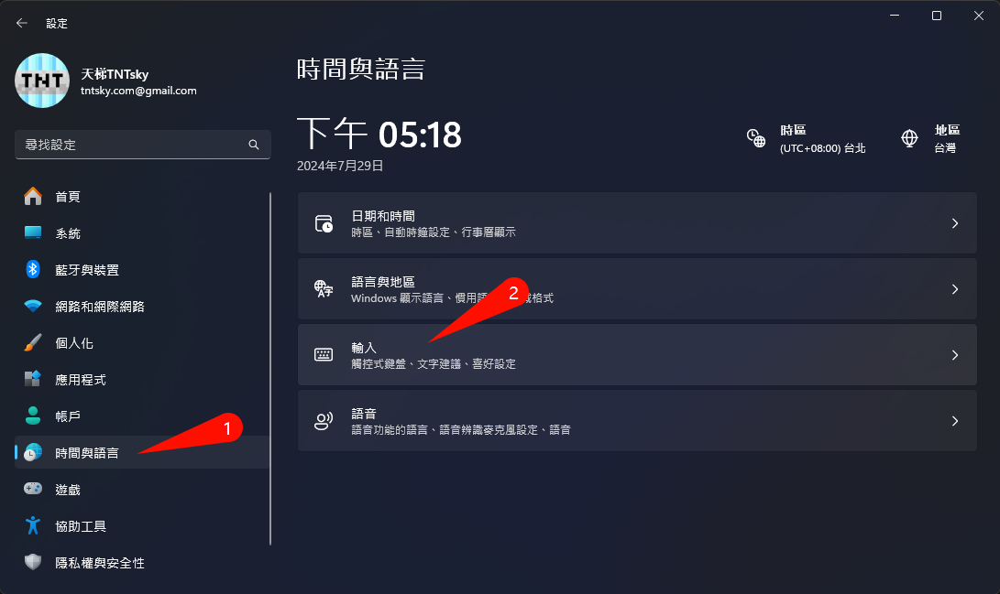
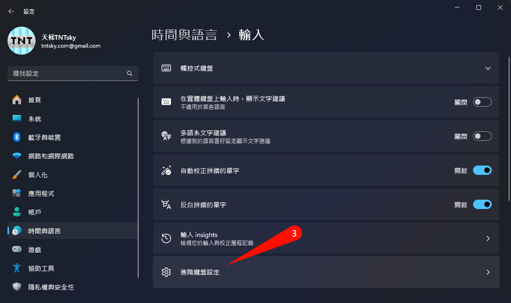
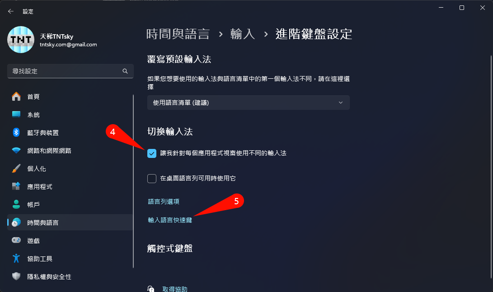
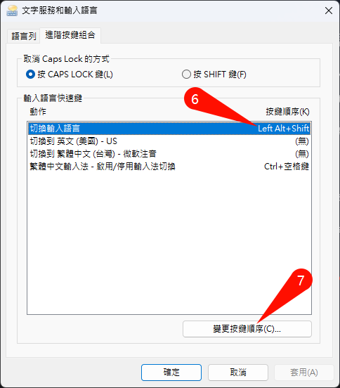
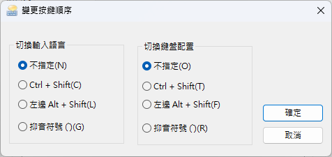
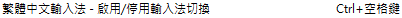

# 遊戲卡輸入法

相信使用微軟中文輸入法的各位都有在玩MC時卡輸入法過，這篇文章將提供建議的解決方針

## 造成原因
會卡輸入法的操作不外乎以下幾項:

* **Ctrl+Shift**：切換輸入法
* **Ctrl+Space**：切換輸入法 (這個還被鎖定，不碰註冊表無法修改)
* **Shift+Space**：切換全/半形
* **Alt+Shift**：切換語言

## 建議解決方案
### 添加英文鍵盤
玩遊戲時切換至英文鍵盤，這樣除了`Win+Space`外基本不會遇到卡鍵
1. 開啟設定-`時間與語言`-`語言與地區`\
   
2. `新增語言`-搜尋US選擇`英文(美國)`\
   
3. 按下一步安裝即可\
   
4. 安裝完畢後點擊`Win+Space`可切換鍵盤\
   

:::success 欲遊戲時切鍵盤
只要在玩遊戲時，使用`Win+Space`切換至英文鍵盤，就不會遇到卡鍵問題了
:::

### 建議快捷鍵修改
雖說切換到英文鍵盤後基本不會遇到卡鍵，但有些快捷鍵還是有機會遇到，因此建議全部改掉
1. 開啟設定-`時間與語言`-`輸入`\
   
2. 進入`進階鍵盤設定`\
   
3. 建議勾取本選項，接著開啟`輸入語言快速鍵`\
   
4. 更改快速鍵\
   
5. 都選取`不指定`即可停用快速鍵\
   
6. 記得按確定

:::warning 微軟在搞
他雖然給了你這個選項，但`Ctrl+Space`你是改不掉的，放棄吧。\
\
不過切到英文鍵盤自然也不會被這卡到了。
:::