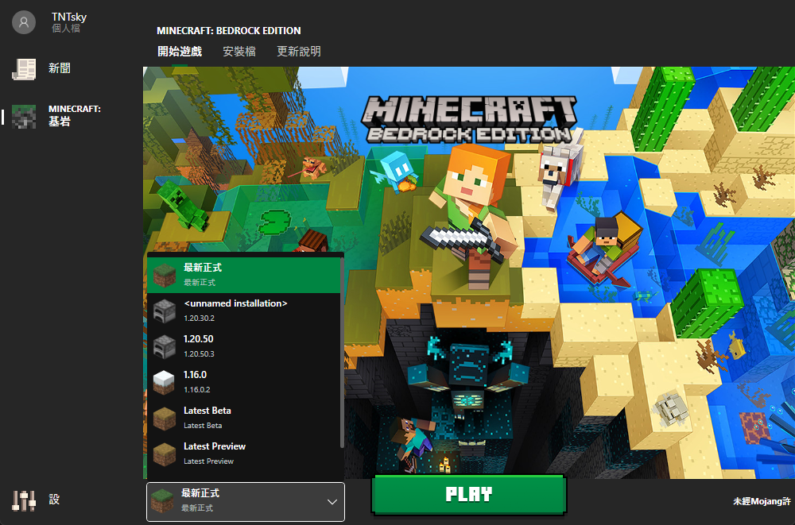
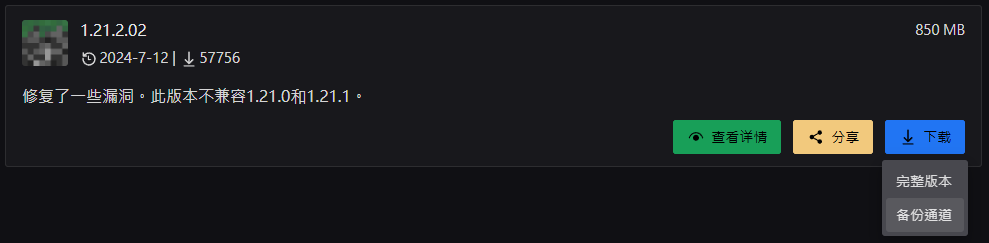

# 切換BE遊戲版本

BE無論在手機版或是Win10版，正常情況下只能存在一個遊戲版本，本篇提供自訂安裝版本的方法

:::success 請支持正版
本篇主要介紹如何遊玩舊版，並非宣傳盜版程式
:::

## Win10
* 安裝第三方啟動器 [Bedrock Launcher](https://bedrocklauncher.github.io/)
* 即可使用類似JAVA版的版本切換功能\
  

## Android
* 可在 MineBBS论坛 下載各版本安裝包
* [MCDL 我的世界国际版下载](https://mc.minebbs.com/)

1. 找到版本後長按`下载`按鈕(請勿直接點擊)
2. 點擊`备份通道`\
   
3. 下載所需版本
   * 前綴arm版本:
      * **v8a**: 64位元版本(請直接選擇此項)
      * **v7a**: 32位元版本(給超古老裝置使用)
   * 後綴修改版本
     * **原版**: (不太確定跟無後綴差在哪)
     * **去音樂包**: 體積較小推薦中低階機使用
     * **路徑修改**: 將遊戲目錄路徑改回公有目錄

## IOS
* 窩沒蘋果裝置\
   

