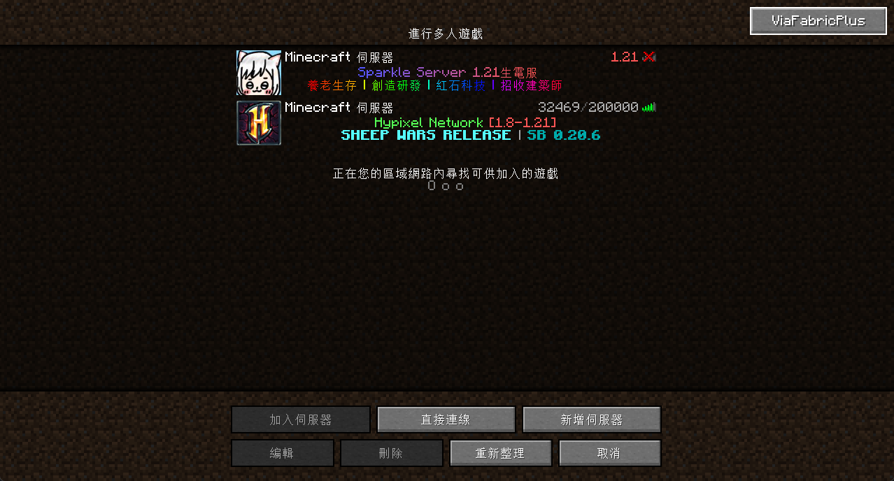
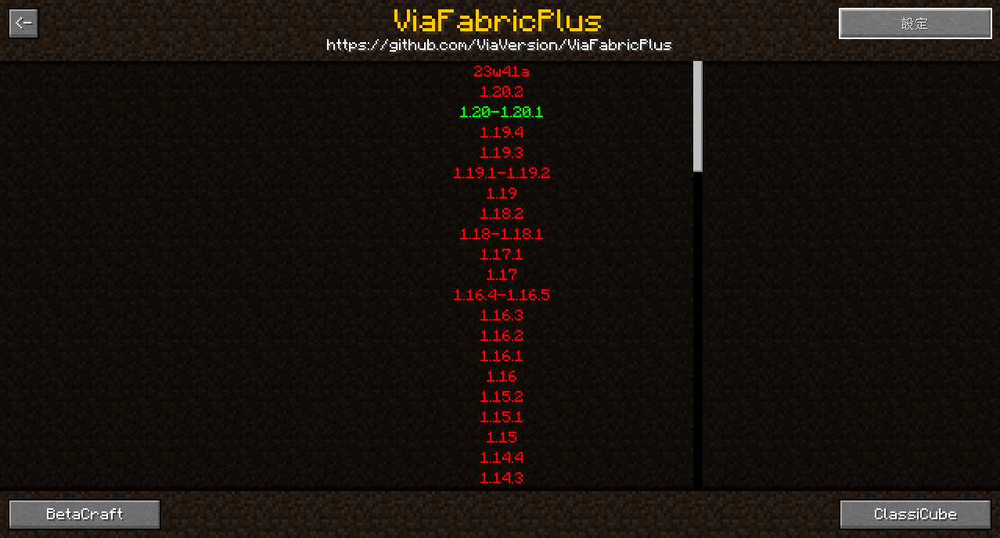
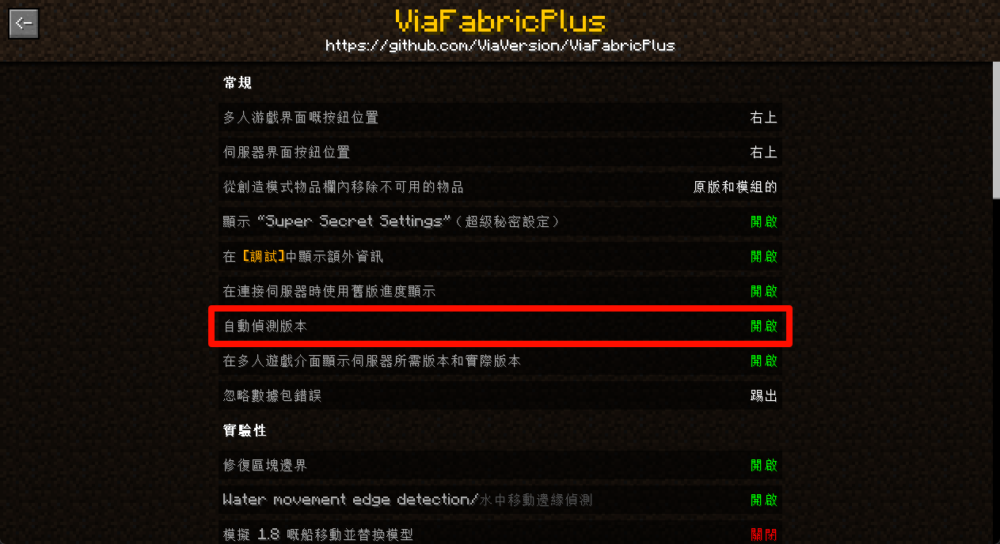
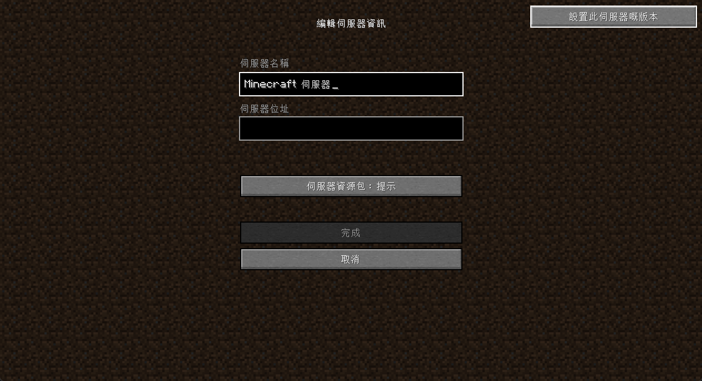
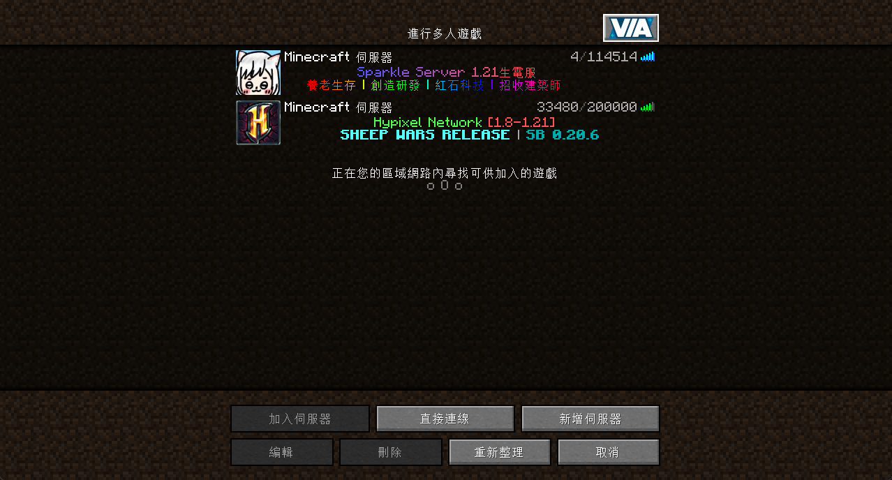
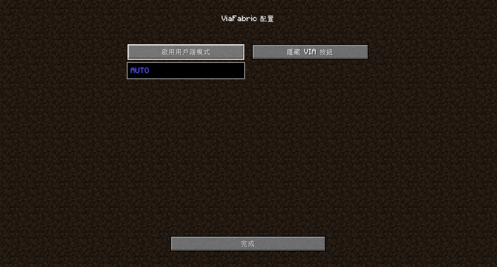
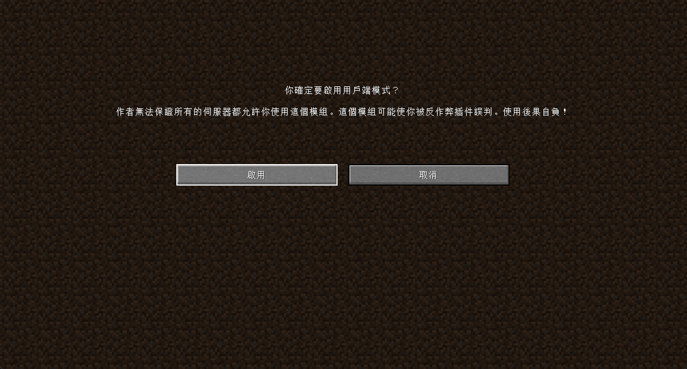

# 客戶端跨版本連線教學

ViaVersion 是一款支援 Minecraft 客戶端跨版本連線的模組。透過 ViaVersion，你可以使用不同的 Minecraft 版本連接到伺服器，不再受限於伺服器的版本。

:::tip
本篇僅介紹客戶端模組的選擇與使用方法，幫助玩家跨版本連線，不包含伺服器端設定。
:::

:::warning
使用跨版本模組，有可能觸發伺服器的反作弊系統，請知曉風險後再使用
:::

## 依據用途選擇模組

* 根據您的需求（是否要遊玩較高版本、較低版本或 BE 伺服器）
  * 僅遊玩舊版伺服器(含BE) (您的版本較新):
    * 使用 [ViaFabricPlus](#viafabricplus)
  * 有遊玩新版伺服器需求 (您的版本較舊):
    * 使用 [ViaFabric](#viafabric) 搭配 ViaVersion、ViaBackwards
  
* 具體選擇如下
    | 您的版本    | 伺服器版本 | 選擇                                              | 詳情                |
    | ----------- | ---------- | ------------------------------------------------- | ------------------- |
    | 1.17+    | 較舊版本(含BE) | ViaFabricPlus                                     | 優先使用            |
    | 1.12+        | 較舊版本   | ViaFabric                                         | 與ViaFabricPlus衝突 |
    | 1.12+        | 較新版本   | ViaFabric + ViaVersion + ViaBackwards             | 與ViaFabricPlus衝突 |
    | 1.7 / 1.8 | 較新版本   | ViaFabric + ViaVersion + ViaBackwards + ViaRewind | 與ViaFabricPlus衝突 |

:::success 推薦
若無連線至較新版伺服器的需求，請優先使用 [ViaFabricPlus](#viafabricplus)
:::

### ViaFabricPlus
* 可連線至包含BE在內幾乎所有(在此之前推出)的版本
* 相較於其他模組，本模組側重於客戶端的額外修復，提高與其他版本伺服器的兼容性
* 無法與其他 ViaVersion 系列模組兼容
* 載點:https://modrinth.com/mod/viafabricplus/

    
使用方法

    * 使用此模組需將其他 ViaVersion 系列模組停用
    * 進入`多人遊戲`介面後，可在右上角看到按鈕\
      
    * 點擊後可設定默認連線的伺服器版本\
      
    * 右上可進入更多設定(包含登入BE帳號)
    * 可開啟自動偵測版本\
      
    * 也可在編輯伺服器介面右上設定個別版本\
      

### ViaFabric
* 最常見的 ViaVersion 客戶端模組，支援連線至較舊版本伺服器
* 搭配 ViaBackwards 可連線至較新版本伺服器 (幾乎所有JE伺服器)

#### ViaBackwards
* 支援連線至較新版本伺服器
* 前置模組: ViaFabric、ViaVersion

#### ViaRewind
* 專為 Minecraft 1.7 和 1.8 客戶端設計的模組
* 前置模組: ViaFabric、ViaVersion、ViaBackwards

| 模組         | 官方載點                               |
| ------------ | -------------------------------------- |
| ViaFabric    | https://modrinth.com/mod/ViaFabric     |
| ViaVersion   | https://modrinth.com/plugin/ViaVersion |
| ViaBackwards | https://modrinth.com/mod/ViaBackwards  |
| ViaRewind    | https://modrinth.com/mod/ViaRewind     |

    
使用方法

    * 進入`多人遊戲`介面後，可在右上角看到按鈕\
      
    * 點選啟用戶端模式\
      
    * 查看說明文字後點擊啟用即可\
      

