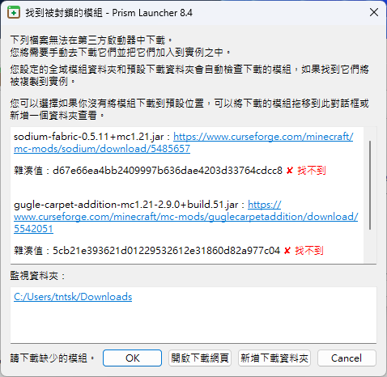
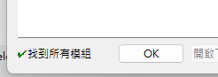

# 安裝模組整合包

本篇主要簡單介紹模組整合包與如何安裝，在此不提及整合包的製作

## 簡單介紹
整合包內通常含有以下基本內容:
* **/mods/** : 各項模組
* **/config/** : 模組的設定配置
* **/resourcepacks/** : 資源包(材質、音效等)
* **/shaderpacks/** : 光影

    
整合包分類

        依照打包形式的不同，通常可分成以下幾種:
        ### (推薦)CurseForge包
        * 檔案通常最小
        * 安裝時才從平台上下載所需模組
        * 通用性最高
        * 格式為`zip`
        ### Modrinth包
        * 與CurseForge包相同，安裝時才下載模組
        * 檔案同樣也很小
        * 格式通常為`mrpack`，也會有`zip`
        ### 個別啟動器匯出
        * 包含完整模組內容，檔案較大
        * 通用性較低
        * 內部有時會附有啟動器便於遊玩
        ### 手動精簡包
        * 內部只包含`mod`、`config`等資料夾
        * 需自行拉入遊戲資料夾
        ### 無腦全包
        * 將整個遊戲資料夾連帶核心全部壓縮在一起
        * 檔案大小突破天際
        * 正面對決版權相關問題

## 如何安裝
以下列出幾款啟動器的安裝整合包方式，載點皆可在[第三方啟動器推薦](/docs/other/launcher)取得。

本服提供CurseForge包，可用於除了Modrinth外大部分啟動器。

### [PCL2](/docs/other/launcher#pcl2)、[HMCL](/docs/other/launcher#hmcl)
* 支援 CurseForge、Modrinth、MCC、MCBBS 等幾乎所有格式整合包
* 直接將整合包**拖入啟動器視窗**便可開始安裝
* 安裝完點擊`版本选择`選中整合包後即可啟動遊戲

### [Prism Launcher](/docs/other/launcher#prism-launcher)
* 支援 CurseForge、Modrinth、MCC 等常見整合包
* 直接將整合包**拖入啟動器視窗**便可開始安裝

    
彈出: 找到被封鎖的模組

        * 請勿直接點擊OK (點惹就關掉重來一遍)\
            
        * 請依提示點擊`開啟下載網頁`下載缺少檔案\
            
        * 顯示找到所有模組後即可按下OK繼續\
            

### [CurseForge App](/docs/other/launcher#curseforge-app)
* 僅支援安裝CurseForge包
* 不同版本介面略有差異，請尋找`匯入(Import)`字樣
1. 點擊上方`建立自訂設定檔`\
    
2. 點擊`匯入`即可\
    

### [Modrinth App](/docs/other/launcher#modrinth-app)
* 僅支援安裝Modrinth包
* 無法直接匯入CurseForge包
* 但可從 CurseForgeApp、PrismLauncher 等其他啟動器匯入設定檔
* 自行研究 :D