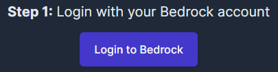
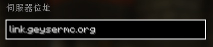

# 基岩版(BE)玩家需知

:::success 目前伺服器為 **JAVA服**，透過模組使BE也可加入遊玩，但分別使用兩個版本進服，存檔是分開的。
:::

## 基岩版玩家前綴
為了防止ID衝突，基岩版玩家ID會在最前方加上 `.`  
即 `Steve` -> `.Steve`

## 基岩版白名單申請
BE加入白名單較JE麻煩。\
需至少先進入伺服器一次後才可加入白名單。
:::warning 使用BE者請在第一次進服前通知管理員。
:::

## 連結JAVA/BE帳號
> 可透過連結雙版本帳號，讓BE進服也**使用JAVA存檔**

[請點此開啟帳號連結網頁](https://link.geysermc.org/method/online)
### 依照指示點擊登入按鈕
1. 登入基岩版(BE)帳號  
   
2. 登入JAVA版帳號  
   
3. 確認ID無誤即完成帳號連結  
   

連結後即可在手機版上遊玩JAVA存檔。

:::warning 若先前曾以BE進入過伺服器，連結後將無法遊玩**原先BE存檔**。
:::

## 解除雙版本帳號連結
進入伺服器並輸入命令 **(JAVA與BE二擇一即可)**

### JAVA版
1. 進入伺服器 `link.geysermc.org`  
   
2. 輸入 `/unlinkaccount` 即可

### 基岩版(BE)
1. 進入伺服器 `link.geysermc.org` `19132` [點此快速添加](minecraft://?addExternalServer=GlobalLinkServer|link.geysermc.org:19132)  
   
2. 輸入 `/unlinkaccount` 即可

:::warning 記得重啟遊戲。
:::
