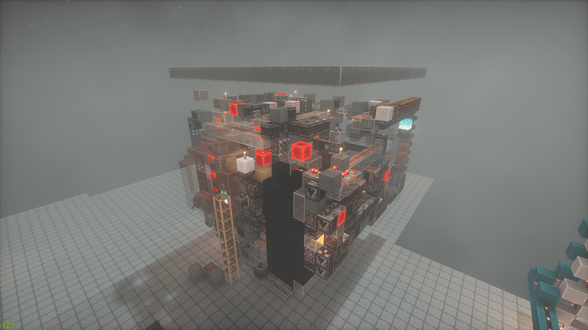
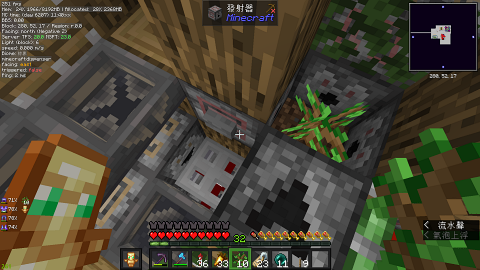
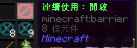
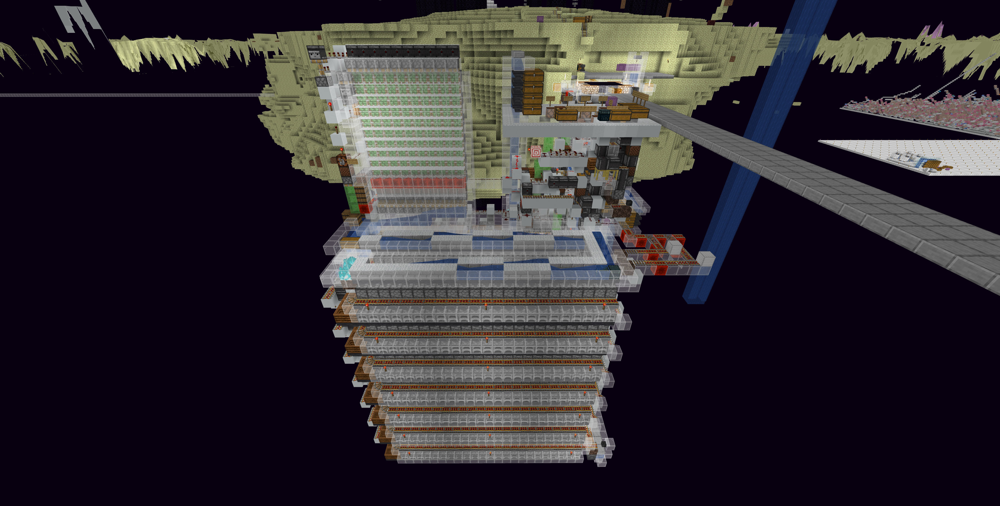

# 終界設施

## 樹廠
> 終界 (289, Y, 19)\
> 
* 效率很高，不需要掛整晚
* 故障麻煩在聊天室[@服主](https://discord.com/users/581468949829648384)，並附上圖片，將會評估要修或是回檔
* 叢林木會有樹苗回收率不足問題
<details>
    <summary>使用方式</summary>
        1. 站進此坑內\
            

        2. 對準偵測器的這格像素，並向前走到底\
            
        3. 放置假人
           ```
           /player tree spawn
           ```
        4. 右鍵假人打開背包，點選右上角連續使用\
            
        5. 泥土上種上樹苗，到外面拉骨塊上的開關\
            
</details>
:::warning 注意
橡木請手動限高，在第八格高的位置放黑曜石\
其他樹種皆可以直接種(紅樹、黑橡木除外)
:::

## 凋零玫瑰農場
> 終界 (-668, Y, 791)\
> \
> 從本島旁邊一長條泥土的門過去 

## 640熔爐
> 終界出生點旁
> 
* 僅支持盒裝輸入(接受非滿盒)
* 無白名單(請不要亂丟東西進去)
* 燒完自動打包
* 滿盒在上面
* 非滿盒在下面


