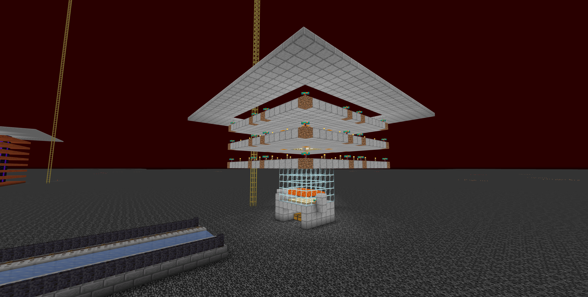
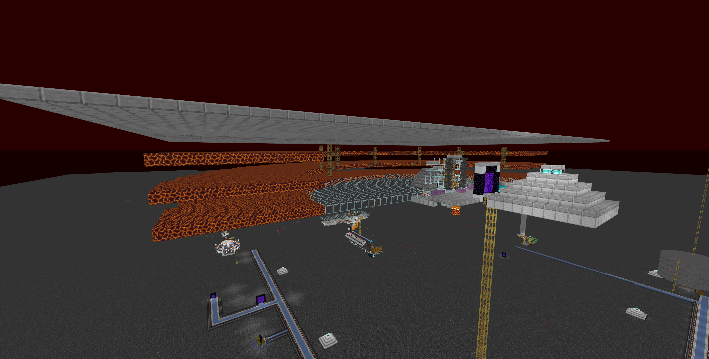

# 地獄設施

## 鞋墊農場(豬肉塔)
> 地獄 (-260, Y, -150) 位在豬人塔旁\
> 

## 刷經驗用豬人塔
> 地獄 (77, 247, -36)\
> 
:::warning 不刷豬人可能是因為偽和平沒關或是下面有人
:::

## 玄武岩機
> 地獄 (80, Y, -300)\
> 

## 主世界偽和平
> 地獄 (2500, Y, 2500)\
> 開關在地獄的地獄門上 主世界不要過去\
> 
<details>
    <summary>遠程開關方式</summary>
        1. 召喚假人
                ```
                /player FakePeace spawn at 2518.55 131.00 2513.47 facing -358.94 2.25 in minecraft:the_nether
                ```
        2. 讓假人點擊使用
                ```
                /player FakePeace use
                ```
        3. 殺死假人
                ```
                /player FakePeace kill
                ```
</details>
<details>
    <summary>確認是否有被正確開啟</summary>
        1. 輸入
            ```
            /log mobcaps overworld
            ```
        2. 按下 TAB 若第一個數字在1000左右即為正確開啟，若遠低於則為未開啟
</details>
:::warning 此偽和平僅對 **主世界** 刷怪有影響 地獄會照常刷怪
:::

## 地獄偽和平
> 地獄 (0, Y, 1000)\
> 
<details>
    <summary>遠程開關方式</summary>
        1. 召喚假人
                ```
                /player fakepeace_nether spawn at 55.54 -10.00 7608.50 facing -90.91 3.75 in minecraft:overworld
                ```
        2. 讓假人點擊使用
                ```
                /player fakepeace_nether use
                ```
        3. 殺死假人
                ```
                /player fakepeace_nether kill
                ```
</details>
<details>
    <summary>確認是否有被正確開啟</summary>
        1. 輸入
            ```
            /log mobcaps nether
            ```
        2. 按下 TAB 若第一個數字在350左右即為正確開啟
</details>
:::warning 此偽和平僅對 **地獄** 刷怪有影響 主世界會照常刷怪
:::


