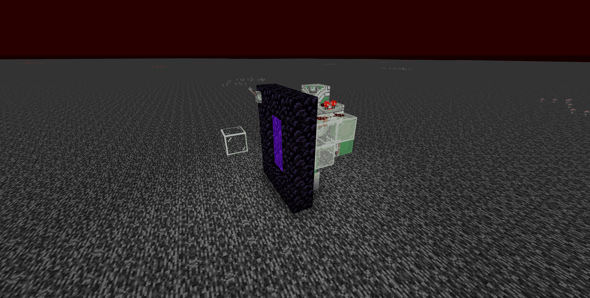
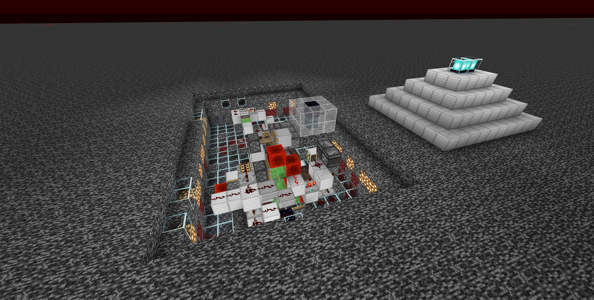

# 其他設施
各種雜亂設施集

## 永晝機
> 主世界 (554, Y, -1920) \
> 
<details>
    <summary>使用方式</summary>
      1. 呼叫假人
              ```
              /player sleep spawn at 554.57 60.13 -1921.50 facing 359.80 -0.60 in minecraft:overworld
              ```
      2. 讓假人蹲下(?
              ```
              /player sleep sneak
              ```
      3. 讓假人持續右鍵
              ```
              /player sleep use continuous
              ```
      * 若要關閉永晝機
              ```
              /player Sleep stop
              ```
</details>
:::success 不用讓此假人下線 主要是用來加載主城的
:::

## 主世界偽和平
> 地獄 (2500, Y, 2500)\
> 開關在地獄的地獄門上 主世界不要過去\
> 
<details>
    <summary>遠程開關方式</summary>
        1. 召喚假人
                ```
                /player FakePeace spawn at 2518.55 131.00 2513.47 facing -358.94 2.25 in minecraft:the_nether
                ```
        2. 讓假人點擊使用
                ```
                /player FakePeace use
                ```
        3. 殺死假人
                ```
                /player FakePeace kill
                ```
</details>
<details>
    <summary>確認是否有被正確開啟</summary>
        1. 輸入
            ```
            /log mobcaps overworld
            ```
        2. 按下 TAB 若第一個數字在1000左右即為正確開啟，若遠低於則為未開啟
</details>
:::warning 此偽和平僅對 **主世界** 刷怪有影響 地獄會照常刷怪
:::

## 地獄偽和平
> 地獄 (0, Y, 1000)\
> 
<details>
    <summary>遠程開關方式</summary>
        1. 召喚假人
                ```
                /player fakepeace_nether spawn at 55.54 -10.00 7608.50 facing -90.91 3.75 in minecraft:overworld
                ```
        2. 讓假人點擊使用
                ```
                /player fakepeace_nether use
                ```
        3. 殺死假人
                ```
                /player fakepeace_nether kill
                ```
</details>
<details>
    <summary>確認是否有被正確開啟</summary>
        1. 輸入
            ```
            /log mobcaps nether
            ```
        2. 按下 TAB 若第一個數字在350左右即為正確開啟
</details>
:::warning 此偽和平僅對 **地獄** 刷怪有影響 主世界會照常刷怪
:::

## 640熔爐
> 終界出生點旁
> 
* 僅支持盒裝輸入(接受非滿盒)
* 無白名單(請不要亂丟東西進去)
* 燒完自動打包
* 滿盒在上面
* 非滿盒在下面

