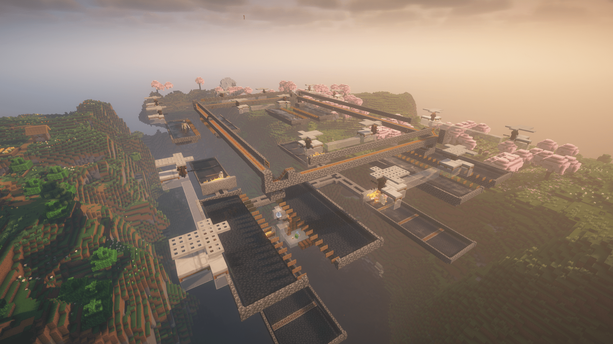
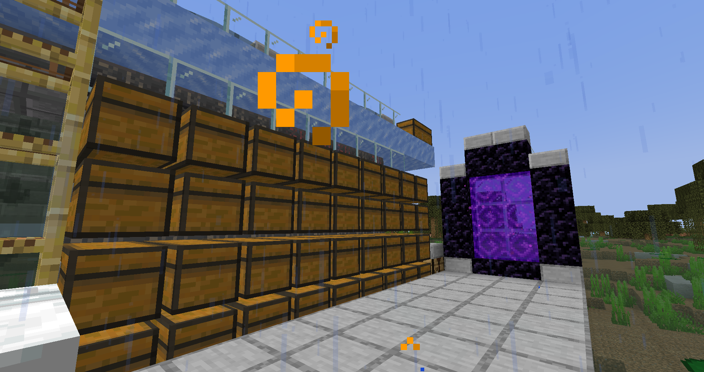
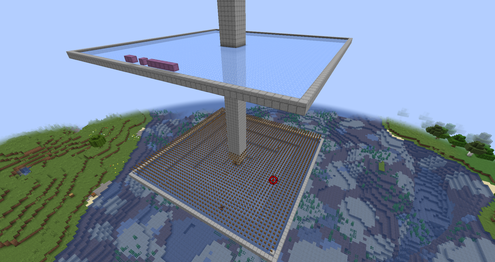
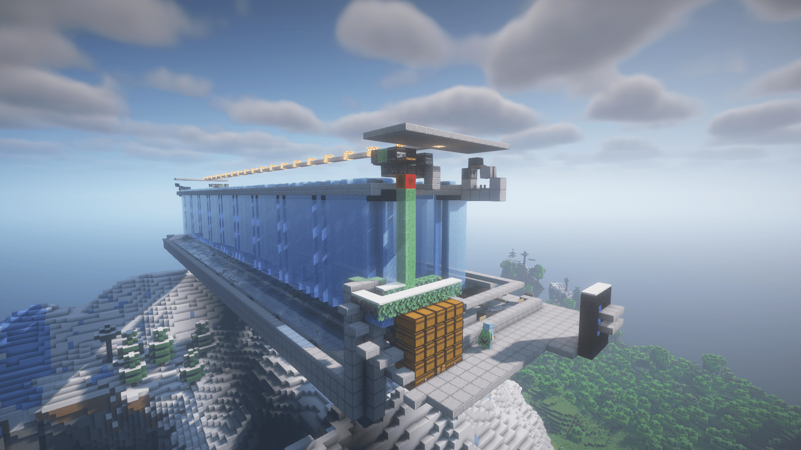
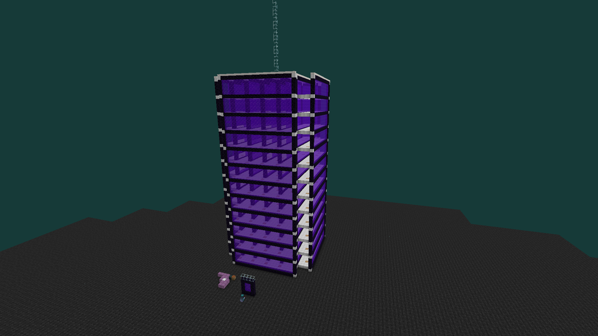
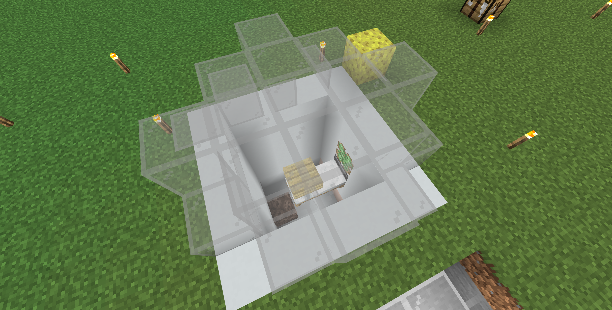

# 主世界設施

## 界浮蚌農場 (已損壞)
> 主世界 (23, 132, 164)\
> 地獄 (2, Y, 20)\

<details>
    <summary>使用方式</summary>
        * 將假人掛在有靈魂火的門內，接著拉下拉桿啟動機器
        * 假人可掛可不掛，掛假人可提升200~300效率，但不掛請勿卸載區塊 
</details>
:::warning 請勿跑上屋頂，可能會導致船被打掉
:::

## 鐵人塔
> 主世界 (1200, Y, -346)\
> 地獄 (155, Y, -49)\


## 印鈔機 (已損壞)
> 主世界 (160, Y, 160)\
> 地獄 (20, Y, 20)\


## 刷怪塔
> 主世界 (-189, Y, -1095)\
> 地獄 (-22, Y, -136)\
> 
## 沉屍塔
> 主世界 (1792, Y, 436)\
> 地獄 (224, Y, 55)\
> 

## 凋零塔
> 主世界 (7550, Y, -2600)\
> \
> 地獄 (941, Y, -326)\
> 
* 假人指令:
    ```
    /player Wither spawn at 939.51 185.00 -326.37 facing 1 1 in minecraft:the_nether
    ```

## 刷冰機
> 主世界 (1284, Y, -633)\
> 地獄 (160, Y, -78)\
> 

## 惡魂塔
> 地獄 (-180, Y, 250)\
> 請走旁邊的小地獄門\
> \
> 出來後沿著箭頭方向飛\
> \
> 主世界 (-1450, Y, 2040)\
> 

## 永晝機
> 主世界 (760, Y, -400) (主城內)\
> 
<details>
    <summary>使用方式</summary>
      1. 呼叫假人
              ```
              /player Sleep spawn at 764.31 67.88 -411.53 facing 2070.90 7.20 in minecraft:overworld
              ```
      2. 讓假人持續右鍵
              ```
              /player Sleep use continuous
              ```
      * 若要關閉永晝機
              ```
              /player Sleep stop
              ```
</details>
:::success 不用讓此假人下線 主要是用來加載主城的
:::

## 豬人塔
> 地獄 (-400, Y, -100)\
> \
> 從 **最上方地獄門** 出來後，朝著箭頭向南方走即為處死裝置
> \
> 主世界 (-3360, Y, -720)\
> 

