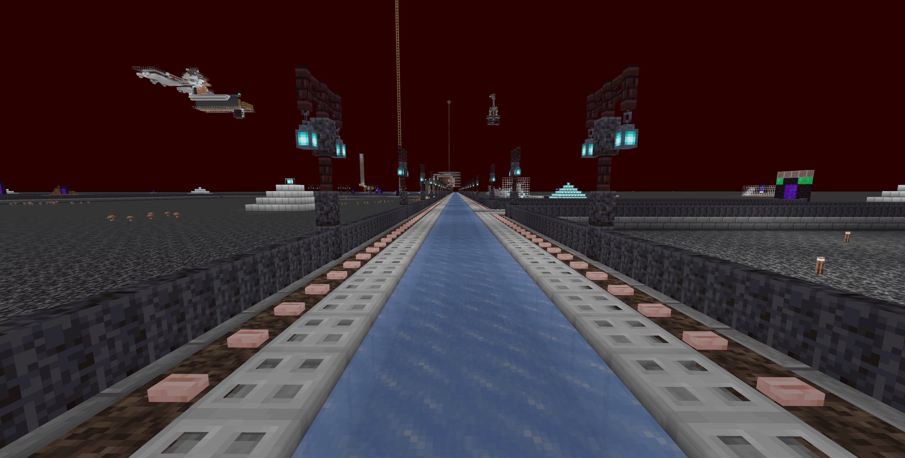
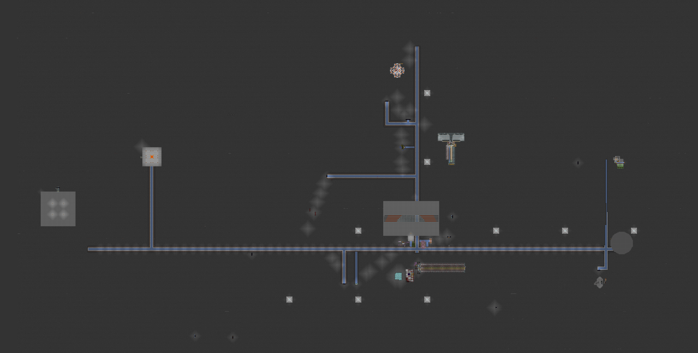
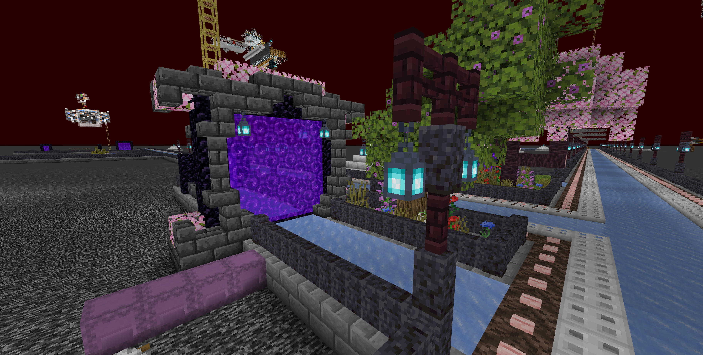
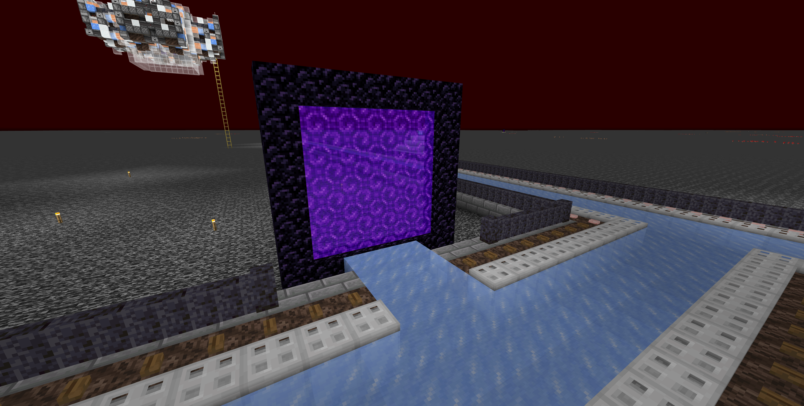

# 基礎設施
包含出生點、地獄交通、主城等基本內容

## 玩家出生點
* 進到世界映入眼簾的是一片荒郊野外

* 沿著鐵軌一路前行，可看到一座地獄門(旁邊為界浮蚌農場)，進入地獄門即可來到作為主要交通樞紐的地獄交通網路

## 地獄交通網路
* 作為主要交通樞紐的地獄交通網路連接著多個地區，可乘坐船進行快速移動

* 地獄交通俯視圖

## 主城
* 可從地獄交通進入
    > 地獄座標 : (99, Y, -44)\
    
* 從地獄門出來後，前方即為玩家公寓<s>(監獄)</s>
    > 主世界座標 : (803, Y, -359)\
    
* 可在附近安家(?)

## 終界傳送門
> 地獄座標 (95, Y, -215)\
> \
> 可由刷沙機進入終界\
> 